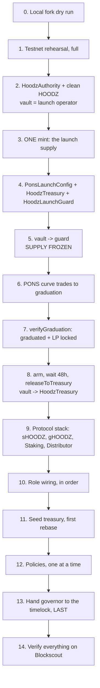

# Hoodz — Deployment Runbook

> **UNAUDITED.** Deploying this code to a network where it can hold real value is a decision to
> risk losing all of that value. Read [`SECURITY.md`](SECURITY.md) first. This runbook assumes you
> have decided anyway.

This is a runbook, not a tutorial. Work top to bottom. Do not skip the testnet rehearsal, and do
not reorder the role-wiring section — the order in §7 is the deployment.

**Contents**

1. [Preconditions](#1-preconditions)
2. [Prerequisites and tooling](#2-prerequisites-and-tooling)
3. [Environment](#3-environment)
4. [The deployment at a glance](#4-the-deployment-at-a-glance)
5. [Phase 0 — local fork dry run](#5-phase-0--local-fork-dry-run)
6. [Phase 1 — testnet rehearsal (46630)](#6-phase-1--testnet-rehearsal-46630)
7. [Phase 2 — the PONS launch](#7-phase-2--the-pons-launch)
8. [Phase 3 — the protocol stack](#8-phase-3--the-protocol-stack)
9. [Phase 4 — role wiring, in order](#9-phase-4--role-wiring-in-order)
10. [Phase 5 — policies](#10-phase-5--policies)
11. [Post-deploy checklist](#11-post-deploy-checklist)
12. [Blockscout verification](#12-blockscout-verification)
13. [Mainnet (4663): what changes](#13-mainnet-4663-what-changes)
14. [Abort criteria and rollback](#14-abort-criteria-and-rollback)
15. [The launch manifest](#15-the-launch-manifest)

---

## 1. Preconditions

Do not start until every line is true.

- [ ] `forge test -vvv` passes with zero failures and zero skipped tests.
- [ ] `forge build --sizes` shows every contract under the EIP-170 limit of 24,576 bytes.
- [ ] `npm run compile` exits 0 with no errors.
- [ ] `forge coverage` has been reviewed and the uncovered branches are understood and accepted.
- [ ] Every contract carries the `UNAUDITED` banner, `pragma solidity ^0.8.24`, and
      `SPDX-License-Identifier: AGPL-3.0-or-later`.
- [ ] The full testnet rehearsal (§6–§11) has been completed **end to end**, including role
      handover, and the resulting deployment was exercised for at least a week of real epochs.
- [ ] Governor, guardian and policy multisigs exist, their signers have tested signing on
      Robinhood Chain, and their thresholds are agreed and documented.
- [ ] The reserve token address, its yield wrapper, and the price source the Emissions Manager will
      read are all decided, deployed and verified.
- [ ] Two people are present for mainnet. One drives, one reads every address aloud before it is
      broadcast. This is not ceremony — the single most likely failure mode is a wrong address in a
      role assignment.

---

## 2. Prerequisites and tooling

```bash
node --version        # >= 18
forge --version       # Foundry, recent
cast --version
```

Install and build:

```bash
git clone <repo> && cd PONSDAO
npm install --no-audit --no-fund
cd contracts
forge install foundry-rs/forge-std --no-commit    # once; forge-std is not vendored
forge build
forge test -vvv
```

Both networks are pre-declared in `foundry.toml`, so `--rpc-url robinhood` and
`--rpc-url robinhood_testnet` resolve without pasting URLs.

Confirm you are pointed at the chain you think you are, every single time:

```bash
cast chain-id --rpc-url robinhood_testnet   # -> 46630
cast chain-id --rpc-url robinhood           # -> 4663
```

| Key       | Mainnet                                   | Testnet                                        |
| --------- | ----------------------------------------- | ---------------------------------------------- |
| Chain ID  | `4663`                                    | `46630`                                         |
| RPC       | `https://rpc.mainnet.chain.robinhood.com` | `https://rpc.testnet.chain.robinhood.com`       |
| Explorer  | `https://robinhoodchain.blockscout.com`   | `https://testnet.robinhoodchain.blockscout.com` |
| Gas token | ETH                                       | ETH                                             |
| EVM       | Cancun                                    | Cancun                                          |

---

## 3. Environment

```bash
cp .env.example .env
```

Fill in every field. The ones that will hurt you if they are wrong:

| Variable                    | Why it matters                                                     |
| --------------------------- | ------------------------------------------------------------------ |
| `PRIVATE_KEY`               | The deployer. **Burner on testnet. Hardware wallet on mainnet.**     |
| `HOODZ_GOVERNOR`             | Ends up holding every privilege. Wrong value = protocol lost.        |
| `HOODZ_GUARDIAN`             | The only key that can stop an incident.                              |
| `HOODZ_POLICY`               | Opens and closes markets.                                            |
| `HOODZ_VAULT`                | The **launch operator**, for one mint. Then the guard, then the treasury. Never anything else. |
| `PONS_*`                    | Immutable once written into `PonsLaunchConfig`.                      |
| `HOODZ_EPOCH_LENGTH`         | `28800` (8h). Changing it changes every yield calculation.           |
| `HOODZ_FIRST_EPOCH_TIME`     | A unix timestamp in the near future. Not in the past.                |

`.env` is gitignored. Keep it that way. Never paste a key into a terminal that logs, never commit a
`broadcast/` directory containing one.

For mainnet, prefer a hardware wallet or a Foundry keystore over a raw key in `.env`:

```bash
cast wallet import hoodz-deployer --interactive
forge script ... --account hoodz-deployer --sender $DEPLOYER_ADDRESS
```

---

## 4. The deployment at a glance



Two rules shape everything:

1. **Mint authority moves last, and only through the guard.** Between step 3 and step 8, HOODZ's
   total supply cannot change, because the `vault` role sits on a contract with no mint function.
2. **The treasury must exist before the guard.** `HoodzLaunchGuard`'s destination is an *immutable*
   `TREASURY` address, so the treasury is deployed early — at step 4, long before it is live — and
   stays inert until step 8.

> **Division of labour with [`PONS_LAUNCH.md`](PONS_LAUNCH.md).** Steps 2–8 above are the launch,
> and `PONS_LAUNCH.md` is the authoritative runbook for them: it lists every signer, every
> pre-flight check and every per-step failure mode. This document covers steps 9–14 — the protocol
> stack around the launch — and summarises the launch only far enough to keep the ordering
> unambiguous. If the two ever disagree about the launch, `PONS_LAUNCH.md` wins.

---

## 5. Phase 0 — local fork dry run

Rehearse against a fork before you spend anything.

```bash
anvil --fork-url https://rpc.testnet.chain.robinhood.com --chain-id 46630
```

In a second shell:

```bash
cd contracts
forge script script/Deploy.s.sol:Deploy \
  --rpc-url http://127.0.0.1:8545 \
  --broadcast \
  -vvvv
```

What to check in the trace:

- Every constructor argument is the address you expect, not `address(0)` and not a leftover from a
  previous run.
- `HoodzAuthority.vault()` is the launch operator before the freeze, and `HoodzLaunchGuard` after it
  — never anything else.
- `HOODZ.totalSupply()` changes exactly once, at the launch mint, and never again during the run.
- No transaction reverted and was silently retried.

---

## 6. Phase 1 — testnet rehearsal (46630)

Fund the deployer with testnet ETH, then simulate before broadcasting. **Omit `--broadcast` first.**

```bash
cd contracts

# 1. simulate
forge script script/Deploy.s.sol:Deploy \
  --rpc-url robinhood_testnet \
  --chain 46630 \
  -vvvv

# 2. broadcast + verify
forge script script/Deploy.s.sol:Deploy \
  --rpc-url robinhood_testnet \
  --chain 46630 \
  --broadcast \
  --slow \
  --verify --verifier blockscout \
  --verifier-url https://testnet.robinhoodchain.blockscout.com/api \
  -vvvv
```

`--slow` sends transactions one at a time and waits for each receipt. On a young L2 this avoids
nonce races and out-of-order execution. Use it every time; the extra minutes are free.

The rehearsal is not complete until you have run **the whole runbook**, including §9's role
handover to test multisigs and at least a week of real epochs with rebases firing. A testnet
deployment that never handed over `governor` has not tested the risky part.

---

## 7. Phase 2 — the PONS launch

> **[`PONS_LAUNCH.md`](PONS_LAUNCH.md) is the authoritative runbook for this phase.** What follows
> is a summary sufficient to place the launch correctly in the overall ordering. Do not run the
> launch from this section alone.

### 7.1 Deploy the pre-launch set

In this exact order:

| # | Contract           | Constructor arguments / notes                                                       |
| - | ------------------ | ----------------------------------------------------------------------------------- |
| 1 | `HoodzAuthority`    | `governor`, `guardian`, `policy` = their multisigs; `vault` = **launch operator**    |
| 2 | `HOODZ`             | `authority`. Mint gated on `authority.vault()`.                                      |
| 3 | —                  | **The single launch mint.** Signed by the launch operator. The only mint before graduation. |
| 4 | `PonsLaunchConfig` | HOODZ, reserve token, curve, target raise, graduation threshold, LP fee tier, lock beneficiary, launch timestamp — **all immutable** |
| 5 | `HoodzTreasury`     | `HOODZ`, `permissionDelay` (seconds), `authority`. **Deployed now, inert until §7.4.** |
| 6 | `HoodzLaunchGuard`  | `authority`, `config`, `launchpad`, `locker`, `poolManager`, **`treasury` (immutable)** |

The treasury is deployed before the guard because the guard's destination address is immutable. It
holds no role and can mint nothing until the handover in §7.4.

Before anything else, confirm the governor multisig can actually sign — a no-op transaction from
it. A governor nobody controls bricks the launch after supply is already frozen.

Verify on the **deployed bytecode**, not the source you believe you deployed: HOODZ has no transfer
tax, no blacklist, no pausable transfers, no rebasing balances, and `mint` reachable only by the
vault. Any transfer hook at all makes HOODZ incompatible with both the PONS curve and the v4 pool it
graduates into.

```bash
cast call $HOODZ "totalSupply()(uint256)" --rpc-url robinhood_testnet   # == published launch supply
cast call $HOODZ "decimals()(uint8)"      --rpc-url robinhood_testnet   # -> 9
```

### 7.2 Freeze supply

```bash
# governor
cast send $AUTHORITY "pushVault(address,bool)" $LAUNCH_GUARD true --rpc-url $RPC --account hoodz-governor

cast call $AUTHORITY "vault()(address)"        --rpc-url $RPC   # -> $LAUNCH_GUARD
cast call $LAUNCH_GUARD "holdsVaultRole()(bool)" --rpc-url $RPC # -> true
```

From here until §7.4, **HOODZ's total supply cannot change** — the guard has no mint function.
Publish the frozen supply and this transaction hash before trading opens. Trading that opens while
the operator still holds `vault` is a launch where the team can mint mid-price-discovery.

The escape hatch, deliberately preserved: the governor keeps `pushVault` on `HoodzAuthority`. If the
guard turns out to be wrong, deploy a corrected one and push the role to it. Supply stays frozen
throughout — the guard is a checkpoint, not a trap.

### 7.3 Trade to graduation

The curve trades until `reserves >= graduationThreshold`, at which point anyone may call
`launchpad.graduate(HOODZ)`. The curve's reserves migrate into a permanently locked Uniswap v4 pool.

```bash
cast call $CURVE "graduated()(bool)" --rpc-url $RPC
cast send $LAUNCH_GUARD "verifyGraduation()" --rpc-url $RPC --account hoodz-governor
```

`verifyGraduation()` fails closed on every branch: it requires that the launchpad reports
graduated, that a locked position exists, and that it is genuinely unlockable by nobody. If it
reverts `NotGraduated` the threshold has not been crossed; if it reverts `LpNotLocked`, **stop** —
read `locker.lockOf(HOODZ)` directly and do not proceed on faith.

Also confirm with your own eyes on the explorer that the position has no unlock path, no timelock
and no owner override. The `lockBeneficiary` is entitled to trading fees only; the principal is
withdrawable by nobody.

### 7.4 Release mint authority — the point of no return

```bash
# governor arms; 48h compiled-in delay; governor releases
cast send $LAUNCH_GUARD "arm()"               --rpc-url $RPC --account hoodz-governor
# ... 48 hours ...
cast send $LAUNCH_GUARD "releaseToTreasury()" --rpc-url $RPC --account hoodz-governor

cast call $AUTHORITY "vault()(address)"          --rpc-url $RPC   # -> $TREASURY
cast call $LAUNCH_GUARD "released()(bool)"       --rpc-url $RPC   # -> true
cast call $LAUNCH_GUARD "holdsVaultRole()(bool)" --rpc-url $RPC   # -> false
```

`releaseToTreasury()` re-checks graduation, the permanent LP lock, that `arm()` happened, and that
48 hours have elapsed — all live, in the same block — then pushes `vault` to the immutable
`TREASURY` and asserts the change landed, reverting `HandoffFailed()` if it did not.

`TRANSFER_DELAY` is a compiled-in constant. **Governance cannot shorten it.** During the window the
guardian may call `abort()`, which cancels the pending release and resets the clock; announce the
arming rather than springing the release on holders.

Immediately confirm nothing else can mint:

```bash
cast send $HOODZ "mint(address,uint256)" $SOME_EOA 1 --rpc-url $RPC --private-key $PK   # must revert
```

---

## 8. Phase 3 — the protocol stack

Deploy in this order. The ordering is forced by constructor dependencies: sHOODZ and gHOODZ reference
each other, so sHOODZ is deployed with no arguments and wired afterwards. The treasury already
exists from §7.1.

| # | Contract       | Constructor arguments                                                                 |
| - | -------------- | ------------------------------------------------------------------------------------- |
| 7 | `sHOODZ`        | none                                                                                   |
| 8 | `gHOODZ`        | `migrator = deployer`, `sHOODZ`                                                          |
| 9 | `HoodzStaking`  | `HOODZ`, `sHOODZ`, `gHOODZ`, `epochLength`, `firstEpochNumber`, `firstEpochTime`, `authority` |
| 10| `Distributor`  | `treasury`, `HOODZ`, `staking`, `authority`                                              |

> **Delta from Olympus:** the treasury's permission queue is measured in **seconds**, not blocks.
> Robinhood Chain's block cadence is not Ethereum's, and a block-denominated delay would silently
> become a different wall-clock delay. See [`SECURITY.md`](SECURITY.md).

`firstEpochTime` must be a timestamp in the near future. If it is in the past, the first `rebase()`
call will roll through several epochs at once.

---

## 9. Phase 4 — role wiring, in order

**This is the deployment.** Everything before it was just putting bytecode on chain.

### 9.1 Token wiring

```bash
# The index starts at 1.0. On a 9-decimal token that is 1e9.
cast send $SHOODZ "setIndex(uint256)" 1000000000            --rpc-url $RPC --private-key $PK
cast send $SHOODZ "setgHOODZ(address)" $GHOODZ                --rpc-url $RPC --private-key $PK
cast send $SHOODZ "initialize(address,address)" $STAKING $TREASURY --rpc-url $RPC --private-key $PK

# One-shot: binds gHOODZ to the staking contract. It cannot be called twice.
cast send $GHOODZ "migrate(address,address)" $STAKING $SHOODZ --rpc-url $RPC --private-key $PK
```

`setIndex` must be called **before** the first rebase. After that the index is a compounding value
and setting it again would rewrite every historical conversion.

`gHOODZ.migrate` is single-use. Get the staking address right.

### 9.2 Staking and distribution

```bash
cast send $STAKING "setDistributor(address)" $DISTRIBUTOR   --rpc-url $RPC --private-key $PK
cast send $STAKING "setWarmupLength(uint256)" 0             --rpc-url $RPC --private-key $PK
cast send $DISTRIBUTOR "setBounty(uint256)" $BOUNTY         --rpc-url $RPC --private-key $PK
cast send $DISTRIBUTOR "addRecipient(address,uint256)" $STAKING $REWARD_RATE --rpc-url $RPC --private-key $PK
```

**(param)** `REWARD_RATE` is in millionths of total supply per epoch: `500` = 0.05% per epoch ≈ 73%
APY. Start low. See [`TOKENOMICS.md`](TOKENOMICS.md) §3 for the full table — the four-digit APYs
are supply schedules, not returns.

### 9.3 Treasury permissions

Each grant is `queueTimelock(...)`, then `execute(index)` after the delay. Revocation is immediate;
granting is not.

| Permission           | Grant to                          | Purpose                              |
| -------------------- | --------------------------------- | ------------------------------------ |
| `RESERVETOKEN`       | reserve token address             | count it as reserves                 |
| `SHOODZ`              | `sHOODZ`                           | supply accounting                    |
| `REWARDMANAGER`      | `Distributor`                     | mint rebase rewards                  |
| `RESERVEDEPOSITOR`   | `BondDepository`                  | bond deposits                        |
| `RESERVEDEPOSITOR`   | `ConvertibleDeposits`             | CD deposits                          |
| `LIQUIDITYTOKEN`     | LP token (+ bonding calculator)   | value POL                            |
| `RESERVEMANAGER`     | yield deployment policy           | put idle reserves to work            |
| `DEBTOR` / `DEBTMANAGER` / `DEBTTOKEN` | Hoodz Loans        | the loan book                        |

```bash
cast send $TREASURY "queueTimelock(uint8,address,address)" $STATUS $ADDR $CALCULATOR \
  --rpc-url $RPC --private-key $PK
# wait out the delay
cast send $TREASURY "execute(uint256)" $INDEX --rpc-url $RPC --private-key $PK
```

Grant the minimum. `RESERVEMANAGER` in particular lets its holder move reserves out against excess
— give it to as few addresses as possible, and prefer a contract with hard-coded destinations over
a multisig with discretion.

### 9.4 Seed the treasury

Move the initial reserves in **without minting HOODZ against them**, by passing the full value as
`profit`:

```bash
cast send $RESERVE "approve(address,uint256)" $TREASURY $AMOUNT --rpc-url $RPC --private-key $PK

# deposit(amount, token, profit) with profit == full value  =>  send_ == 0  =>  no HOODZ minted
cast send $TREASURY "deposit(uint256,address,uint256)" $AMOUNT $RESERVE $VALUE \
  --rpc-url $RPC --private-key $PK

cast call $TREASURY "excessReserves()(uint256)" --rpc-url $RPC     # must be > 0
```

`excessReserves()` must be positive before the first rebase, or `treasury.mint()` reverts and the
distributor fails.

### 9.5 Re-confirm mint authority

Mint authority already moved to the treasury in §7.4, through the guard. Re-confirm it here, before
the treasury is seeded and before any policy is enabled:

```bash
cast call $AUTHORITY "vault()(address)"          --rpc-url $RPC   # -> $TREASURY
cast call $LAUNCH_GUARD "released()(bool)"       --rpc-url $RPC   # -> true
cast call $LAUNCH_GUARD "holdsVaultRole()(bool)" --rpc-url $RPC   # -> false
cast send $HOODZ "mint(address,uint256)" $SOME_EOA 1 --rpc-url $RPC --private-key $PK   # must revert
```

Note that `pushVault` is inherently a one-step handover — a contract cannot call `pullVault()` to
confirm itself — which is exactly why the guard checks the destination against an immutable address
and asserts the result rather than trusting the call to have landed.

### 9.6 Governance handover — do this last

On mainnet, `governor`, `guardian` and `policy` are already the intended multisigs from §7.1 — the
launch cannot safely be run with a deployer EOA holding them. The remaining handover is therefore
usually just `governor` → timelock. On testnet, where the deployer holds all three, run the whole
sequence below; that is the point of the rehearsal.

Use the two-step form with `effectiveImmediately = false` for every role. The new holder must call
`pull*()`, which proves they actually control the address. (`vault` is the exception, and it is not
pushed by hand at all — the guard does it, in §7.4.)

```bash
# policy first, guardian next, governor LAST
cast send $AUTHORITY "pushPolicy(address,bool)"   $POLICY_MSIG   false --rpc-url $RPC --private-key $PK
cast send $AUTHORITY "pushGuardian(address,bool)" $GUARDIAN_MSIG false --rpc-url $RPC --private-key $PK
cast send $AUTHORITY "pushGovernor(address,bool)" $TIMELOCK      false --rpc-url $RPC --private-key $PK

# then, from each recipient:
#   pullPolicy()  /  pullGuardian()  /  pullGovernor()
```

Governor goes last because it is the role that can fix a mistake in the other two. Once the
timelock holds `governor`, every further change costs a proposal and a delay — which is the point,
and also why you want to be certain everything else is right first.

---

## 10. Phase 5 — policies

Deploy and wire the policy layer only after §9 is complete and verified.

| Policy                     | Needs                                             | First action                     |
| -------------------------- | ------------------------------------------------- | -------------------------------- |
| `BondDepository`           | `RESERVEDEPOSITOR`, `policy` role                 | open a small market first         |
| Hoodz Loans                 | debt permissions, oLTC + drip configured          | verify drip ≥ interest rate       |
| `EmissionsManager`         | price source, `backing` seeded, bond depository   | start deactivated                 |
| `YieldRepurchaseFacility`  | yield wrapper address, bond depository            | start deactivated                 |
| `ConvertibleDeposits`      | `RESERVEDEPOSITOR`, auction parameters            | start with tiny daily capacity    |
| `FeeRouterBuyback`         | `(authority, config, feeRouter, swapRouter)`; governor calls `pointFeesHere()` | verify it can only buy and burn, and that `minOut == 0` reverts |

Rules for turning them on:

1. **One at a time.** Enable, observe for a full cadence period, then enable the next.
2. **Smallest possible size first.** A 10,000-reserve bond market before a 1,000,000 one.
3. **Emissions and YRF start off.** Turn them on only once the price source has been observed to be
   sane for several days. The Emissions Manager reads a price and mints against it; a bad feed is
   the most direct path to unbounded issuance in the entire system.
4. **Verify the Hoodz Loans invariant on-chain before the first loan:** the oLTC drip rate must be at
   least the interest accrual rate, or the "no liquidations" promise is false.

---

## 11. Post-deploy checklist

Run every line. Record the output. A "probably fine" here becomes an incident later.

**Authority and access**

- [ ] `authority.governor()` is the timelock (mainnet) — not the deployer.
- [ ] `authority.guardian()` is the guardian multisig.
- [ ] `authority.policy()` is the policy multisig.
- [ ] `authority.vault()` is the treasury, and nothing else.
- [ ] `HOODZ.mint()` from an arbitrary EOA **reverts**.
- [ ] `treasury.withdraw()` from an arbitrary EOA **reverts**.
- [ ] The deployer EOA holds **no** role. Confirm by calling a governor-only function from it and
      watching it revert.
- [ ] Every `pull*()` has been executed. No role is left half-pushed.

**Tokens**

- [ ] `staking.index()` returns `1000000000` (1.0) before the first rebase.
- [ ] `sHOODZ.gonsForBalance(x)` → `balanceForGons(...)` round-trips within rounding.
- [ ] `gHOODZ.migrate()` reverts on a second call.
- [ ] `gHOODZ.mint()` from a non-staking address reverts.
- [ ] `HOODZ` has no transfer tax, blacklist, or pause path. Re-read the verified source.

**Staking and rewards**

- [ ] `staking.secondsToNextEpoch()` is under `HOODZ_EPOCH_LENGTH` and counting down.
- [ ] `distributor.nextRewardFor(staking)` returns the expected amount.
- [ ] A test stake → wait one epoch → `rebase()` → the sHOODZ balance grew by the expected
      percentage and `index()` rose.
- [ ] Unstake returns the expected HOODZ.
- [ ] The rebase bounty is paid to the caller.

**Treasury**

- [ ] `treasury.excessReserves()` > 0.
- [ ] `treasury.baseSupply()` equals `HOODZ.totalSupply()`.
- [ ] `treasury.tokenValue(reserve, 1e18)` returns the expected value in HOODZ decimals.
- [ ] Every permission holder is intentional. Enumerate them; do not assume.
- [ ] Granting a permission takes the full delay; revoking is instant. Both tested.

**PONS**

- [ ] `curve.graduated() == true` and `guard.graduationVerified` is set.
- [ ] The v4 LP position is locked, permanently, verified on the explorer — not just via the guard.
- [ ] `guard.released() == true` and `guard.holdsVaultRole() == false`.
- [ ] `PonsLaunchConfig` values match `docs/pons-launch.json` exactly.
- [ ] Total supply between §7.2 and §7.4 never changed. Check the block range.
- [ ] `FeeRouterBuyback` receives fees, and can only buy HOODZ and burn it — no withdrawal path, no
      arbitrary-call path.
- [ ] `buybackAndBurn(0, ...)` reverts `ZeroMinOut()`.
- [ ] `pendingFees()` returns without reverting.

**Verification and records**

- [ ] Every contract shows verified source on Blockscout.
- [ ] `docs/pons-launch.json` is written, committed, and matches the chain.
- [ ] The guardian multisig has rehearsed at least one shutdown path on testnet
      ([`SECURITY.md`](SECURITY.md)).

---

## 12. Blockscout verification

Blockscout is Etherscan-API compatible, so `--verify --verifier blockscout` during `forge script`
handles most of it. For anything that slipped through:

```bash
# no constructor arguments
forge verify-contract $ADDRESS src/tokens/HOODZ.sol:HOODZ \
  --chain 4663 \
  --verifier blockscout \
  --verifier-url https://robinhoodchain.blockscout.com/api \
  --compiler-version 0.8.24 \
  --num-of-optimizations 200 \
  --watch

# with constructor arguments
forge verify-contract $AUTHORITY src/HoodzAuthority.sol:HoodzAuthority \
  --chain 4663 \
  --verifier blockscout \
  --verifier-url https://robinhoodchain.blockscout.com/api \
  --compiler-version 0.8.24 \
  --num-of-optimizations 200 \
  --constructor-args $(cast abi-encode "constructor(address,address,address,address)" \
      $GOVERNOR $GUARDIAN $POLICY 0x0000000000000000000000000000000000000000) \
  --watch
```

Testnet is identical with `--chain 46630` and
`--verifier-url https://testnet.robinhoodchain.blockscout.com/api`.

Verification only succeeds if the compiler settings match **exactly**: solc `0.8.24`, optimizer on,
`runs = 200`, `evm_version = cancun`, `bytecode_hash = none`. All three toolchain configs in this
repo are already pinned to that; do not override them on the command line.

Check status:

```bash
forge verify-check $GUID --chain 4663 \
  --verifier blockscout \
  --verifier-url https://robinhoodchain.blockscout.com/api
```

If a contract refuses to verify, do not shrug it off. Unverified bytecode holding a treasury is
indistinguishable, to a user, from malicious bytecode holding a treasury.

---

## 13. Mainnet (4663): what changes

Everything in §6–§12 applies unchanged except:

| Aspect            | Testnet                      | Mainnet                                                   |
| ----------------- | ---------------------------- | ---------------------------------------------------------- |
| Key handling      | Burner in `.env`             | **Hardware wallet or Foundry keystore.** Never a raw key.   |
| `governor`        | Deployer EOA is fine         | Timelock, held by the DAO                                   |
| `guardian`        | Deployer EOA is fine         | 3-of-5 multisig, signers on separate hardware               |
| `policy`          | Deployer EOA is fine         | Policy multisig                                             |
| Warmup            | 0 epochs                     | Non-zero, to blunt rebase front-running                     |
| Reward rate       | Anything                     | Start low. Raise by proposal, never at deploy time.         |
| Policy activation | All at once                  | One at a time, smallest size first, days apart              |
| Emissions / YRF   | On immediately               | Off until the price source has been observed for days       |
| Pace              | One session                  | Multiple sessions with deliberate gaps                      |
| Witnesses         | You                          | Two people minimum; addresses read aloud before broadcast   |

```bash
forge script script/Deploy.s.sol:Deploy \
  --rpc-url robinhood \
  --chain 4663 \
  --broadcast \
  --slow \
  --verify --verifier blockscout \
  --verifier-url https://robinhoodchain.blockscout.com/api \
  -vvvv
```

Simulate without `--broadcast` first. Every time. Including the time you are sure.

---

## 14. Abort criteria and rollback

There are two distinct points of no return, and they are not the same point.

* **§7.2 — supply freeze.** After the `vault` role moves to the guard, the *launch* is committed:
  the supply is what it is, and `PonsLaunchConfig` is immutable. You can still deploy a corrected
  guard and push the role to it (supply stays frozen throughout), but you cannot un-mint, un-launch,
  or fix a wrong config value except by abandoning the deployment entirely.
* **§7.4 — mint authority released.** Once `vault` is the treasury and reserves are in, the only
  paths are forward or an emergency shutdown ([`SECURITY.md`](SECURITY.md)).

Before §7.2, aborting is cheap: the contracts are inert and you deploy a fresh set. Between §7.2 and
§7.4, aborting means abandoning a live token. After §7.4, there is no abort.

Stop and reassess if any of these is true:

- [ ] `verifyGraduation()` reverts, or the LP lock cannot be independently verified on the explorer.
- [ ] `HOODZ.totalSupply()` does not equal the published launch supply, at any point before §7.4.
- [ ] Any address in the role table does not match the documented multisig, exactly.
- [ ] The governor multisig has not demonstrated it can sign on this chain.
- [ ] Any `PonsLaunchConfig` value does not match `docs/pons-launch.json`.
- [ ] `excessReserves()` is zero or negative when it should be positive.
- [ ] The Emissions Manager's price source returns anything implausible, at any point.
- [ ] A transaction reverted and you are not certain why.
- [ ] `index()` is not exactly `1e9` before the first rebase.
- [ ] The deployer still holds a role after §9.6.
- [ ] A contract will not verify on Blockscout.
- [ ] Any step of this runbook was performed out of order.

The recovery move before §7.2 is always the same: **deploy a fresh `HoodzAuthority` and a fresh
stack, and abandon the old addresses.** Bytecode on chain costs gas; a mis-wired treasury holding
real reserves costs the treasury.

---

## 15. The launch manifest

`docs/pons-launch.json` is the canonical machine-readable record of what was deployed. It is
committed (explicitly un-ignored by `!docs/pons-launch.json` in `.gitignore`) and rewritten in
place by `contracts/script/DeployPonsLaunch.s.sol`.

The file ships pre-populated with placeholders and a `"status": "UNLAUNCHED"` marker. Its top-level
shape:

| Key             | Contains                                                                    |
| --------------- | --------------------------------------------------------------------------- |
| `manifestVersion`, `description`, `status`, `generatedAt`, `generatedBy` | Provenance. |
| `network`, `knownNetworks` | The selected chain, plus both Robinhood Chain entries.           |
| `roles`         | `governor` / `guardian` / `policy` / `vault` / `launchOperator`.             |
| `token`         | HOODZ name, symbol, **decimals `9`**, address, launch supply, PONS compatibility flags. |
| `launch`        | Curve, reserve token, target raise, graduation threshold, LP fee tier, lock beneficiary. |
| `graduation`    | Whether it graduated, the pool, the locked position.                        |
| `contracts`     | Every deployed address.                                                     |
| `guard`         | `HoodzLaunchGuard` state: armed, released, the immutable treasury target.     |
| `fees`          | Fee route and `FeeRouterBuyback` wiring.                                    |
| `treasurySeed`  | The initial reserve deposit.                                                |
| `verification`  | Blockscout verification status per contract.                                |

Conventions that matter when you read or write it:

* **`uint256` amounts are decimal strings in base units**, never JSON numbers. A 9-decimal token's
  supply does not survive a round trip through a JS `Number`.
* Anything not yet known is `null`, not a guess and not a zero.
* Addresses default to the zero address until the corresponding step has actually executed.
* **Every value must be re-read from the chain before it is trusted.** The manifest is a record,
  not a source of truth.

The `/app` frontend reads its addresses from this file. Commit it in the same change as the
deployment, and never hand-edit it — regenerate it from chain state if it drifts.
[`PONS_LAUNCH.md`](PONS_LAUNCH.md) explains what each launch parameter means and in what order it
becomes real.
