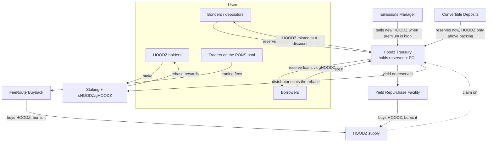
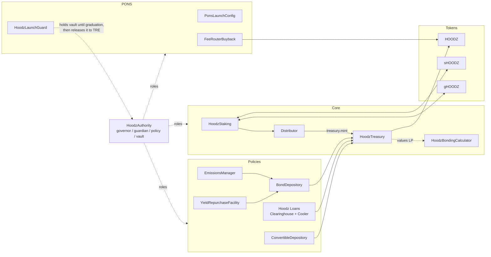
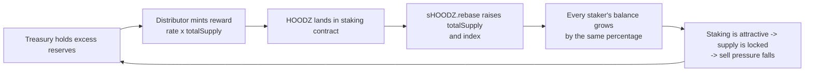
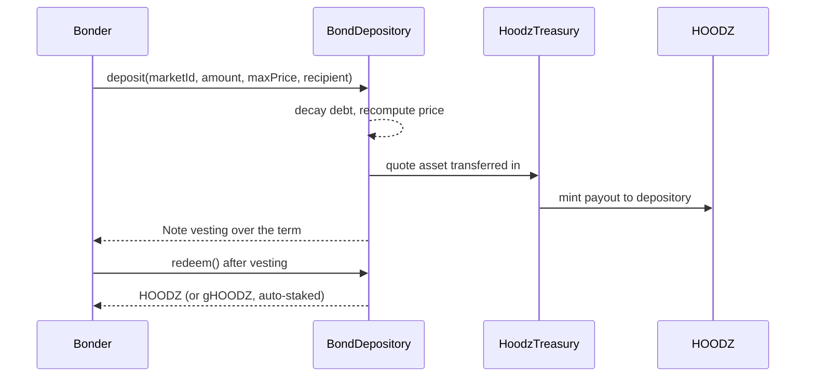
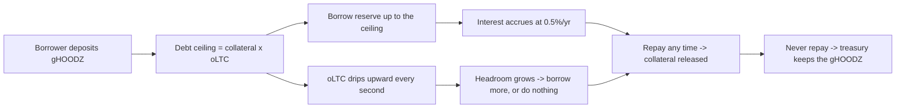
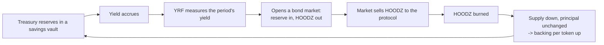
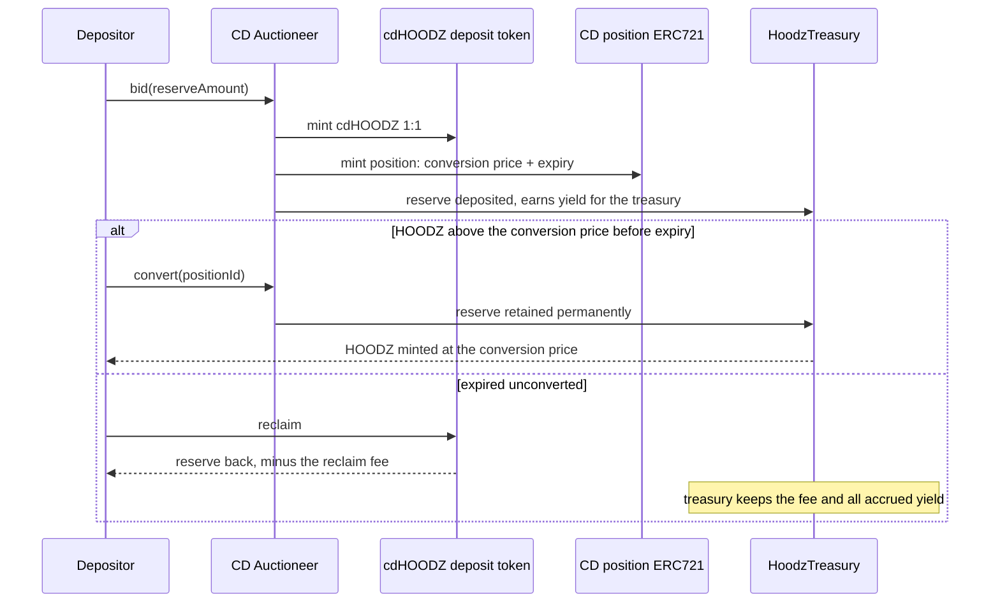
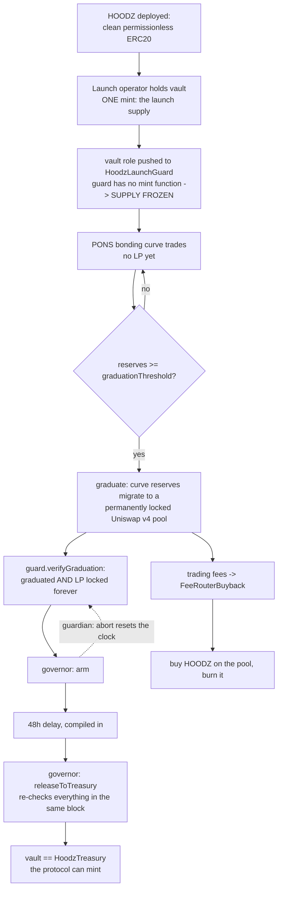
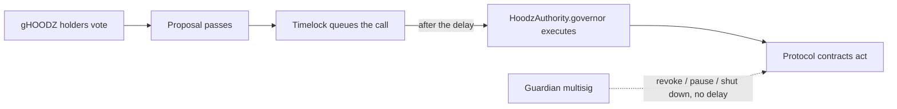

# Hoodz — Protocol

> **UNAUDITED.** This document describes an educational re-implementation of Olympus DAO.
> Nothing here is deployed. Read [`SECURITY.md`](SECURITY.md) before touching any of it.

This is the end-to-end description of how Hoodz works. It assumes you know what an ERC20 is and
what an AMM is, and nothing else. It does **not** assume you have ever used Olympus.

Everything below is Olympus DAO's mechanism design with Hoodz's names on it. Where a number is a
governance-set parameter rather than a protocol invariant it is marked **(param)**.

**Contents**

1. [The shape of the protocol](#1-the-shape-of-the-protocol)
2. [The token trio: HOODZ, sHOODZ, gHOODZ](#2-the-token-trio-hoodz-shoodz-ghoodz)
3. [Staking and the rebase loop](#3-staking-and-the-rebase-loop)
4. [The treasury and what "backing" means](#4-the-treasury-and-what-backing-means)
5. [Bond markets and the control variable](#5-bond-markets-and-the-control-variable)
6. [Hoodz Loans](#6-hoodz-loans)
7. [The Emissions Manager](#7-the-emissions-manager)
8. [The Yield Repurchase Facility](#8-the-yield-repurchase-facility)
9. [Convertible Deposits](#9-convertible-deposits)
10. [PONS fees and buyback-and-burn](#10-pons-fees-and-buyback-and-burn)
11. [Governance and roles](#11-governance-and-roles)
12. [Cadence: who calls what, and when](#12-cadence-who-calls-what-and-when)
13. [Parameter reference](#13-parameter-reference)
14. [Glossary](#14-glossary)

---

## 1. The shape of the protocol

One sentence: **the treasury holds reserves, HOODZ is a claim on those reserves, and every mechanism
in the protocol exists either to add reserves per HOODZ or to decide who receives newly issued
HOODZ.**

Two numbers matter above all others:

* **Backing per HOODZ** — treasury reserves divided by circulating HOODZ. This is what the protocol
  controls.
* **Market price of HOODZ** — what the AMM says. This is what the protocol does *not* control.

The gap between them is the *premium*. Almost every policy module reads the premium and acts on
it: when the premium is high the protocol sells HOODZ to grow reserves; when it is low the protocol
buys HOODZ back and burns it. That is the whole strategy.

### 1.1 The value flows



Read it as two opposing loops:

* **Expansion** (bonds, emissions, convertible deposits, the staking rebase) — HOODZ supply grows.
  Three of those four *also* grow reserves, and by more than they grow supply, so backing per token
  rises anyway. The fourth, the rebase, is a pure transfer from non-stakers to stakers.
* **Contraction** (the YRF, the PONS fee buyback) — HOODZ supply shrinks and reserves are either
  untouched or reduced by less, so backing per token rises.

### 1.2 The contract map



Every protocol contract inherits `HoodzAccessControlled`, which reads its four roles from a single
`HoodzAuthority` instance. Nothing uses `Ownable`.

| Role       | Modifier         | Held by                                    | Can do                                                        |
| ---------- | ---------------- | ------------------------------------------ | ------------------------------------------------------------- |
| `governor` | `onlyGovernor()` | DAO timelock (executes passed proposals)   | Everything: grant treasury permissions, set parameters, move roles |
| `guardian` | `onlyGuardian()` | Fast-response multisig                     | Revoke, pause, shut down. **Never grant.**                    |
| `policy`   | `onlyPolicy()`   | Policy multisig and policy contracts       | Open and close bond markets, tune parameters within bounds     |
| `vault`    | `onlyVault()`    | `HoodzTreasury`                             | Mint and burn HOODZ                                             |

The asymmetry between `governor` and `guardian` is deliberate and load-bearing: the guardian can
stop things instantly without a governance vote, but it cannot start or grant anything. A
compromised guardian can halt the protocol; it cannot steal from it.

---

## 2. The token trio: HOODZ, sHOODZ, gHOODZ

Three tokens, one underlying position. The reason there are three is that "a balance that grows on
its own" is convenient for humans and terrible for smart contracts, so the protocol offers both.

| Token   | Decimals | Balance behaviour                | What it is for                                    |
| ------- | -------- | -------------------------------- | ------------------------------------------------- |
| `HOODZ`  | 9        | Fixed. Ordinary ERC20.           | Trading, LP, the unit of account.                  |
| `sHOODZ` | 9        | **Rebases.** Grows every epoch.  | Staking, when you want to watch the number go up.  |
| `gHOODZ` | 18       | Fixed. Value grows via `index()`.| Governance, collateral, bridging, integrations.    |

> **(param)** Decimals mirror Olympus: 9 for HOODZ/sHOODZ, 18 for gHOODZ. Confirm against
> `contracts/src/tokens/` — the token contracts are the source of truth, not this table.

### 2.1 HOODZ

A clean, permissionless ERC20 plus `mint`, `burn` and `burnFrom`. No transfer tax, no blacklist, no
pausable transfers, no transfer hooks — PONS requires this, and it is also simply the right thing
for a currency token.

Only the address holding the `vault` role on `HoodzAuthority` may mint. In a live deployment that is
the `HoodzTreasury`, and the treasury will only mint against reserves it holds. During the PONS
launch the role is parked on `HoodzLaunchGuard`, which has no mint function — so between the single
launch mint and graduation, HOODZ's total supply is literally unable to change (see §10).

### 2.2 sHOODZ and the gons trick

sHOODZ is a rebasing token. If you hold 100 sHOODZ and the protocol rebases 0.1%, you hold 100.1
sHOODZ — no transaction, no claim, the balance simply changed.

It works the way Ampleforth's does. Internally, sHOODZ does not store balances; it stores **gons**,
an internal unit of which there is a fixed, enormous total:

```
TOTAL_GONS      = MAX_UINT256 - (MAX_UINT256 % INITIAL_FRAGMENTS_SUPPLY)
gonsPerFragment = TOTAL_GONS / totalSupply
balanceOf(a)    = gonBalances[a] / gonsPerFragment
```

A rebase never touches a single user's storage slot. It increases `totalSupply`, which decreases
`gonsPerFragment`, which increases everybody's `balanceOf` by exactly the same percentage in one
write. That is why a rebase costs constant gas regardless of holder count.

The rebase amount is scaled before it is applied:

```
rebaseAmount = profit * totalSupply / circulatingSupply
circulatingSupply = totalSupply - balanceOf(staking) + gHOODZ.balanceFrom(gHOODZ.totalSupply())
```

`profit` is what the distributor minted for stakers. It should be received in full by *circulating*
sHOODZ holders — but a rebase inflates *total* supply, including the unstaked sHOODZ sitting in the
staking contract. Scaling by `totalSupply / circulatingSupply` cancels that out, so circulating
holders receive exactly `profit`. Note that `circulatingSupply` adds back the sHOODZ represented by
wrapped gHOODZ: wrapping does not opt you out of rebases, it just changes how you see them.

`index()` is the cumulative growth factor since launch. It is stored as gons, which is an elegant
detail worth understanding:

```
setIndex(x)  ->  INDEX = gonsForBalance(x)      // stored once, in gons
index()      ->  balanceForGons(INDEX)          // read back in sHOODZ terms
```

Because `INDEX` is denominated in gons, it rebases automatically along with every other balance. No
loop, no bookkeeping. The index starts at `1.0` (`1e9`) and only ever goes up.

### 2.3 gHOODZ

gHOODZ is the same position with the growth expressed as price instead of quantity. One gHOODZ is
always worth `index()` sHOODZ:

```
balanceFrom(gAmount) = gAmount * index / 1e9     // gHOODZ -> sHOODZ
balanceTo(sAmount)   = sAmount * 1e9 / index     // sHOODZ -> gHOODZ
```

Wrapping and unwrapping is not a trade. It changes nothing about your claim; it only changes which
number is constant. Concretely, at `index = 100`:

* 1 gHOODZ = 100 sHOODZ.
* 250 sHOODZ = 2.5 gHOODZ.
* One year later, if the index has reached 110, that same 1 gHOODZ is 110 sHOODZ. The gHOODZ balance
  never moved.

gHOODZ is `ERC20Votes`, so it is the governance token (§11) and the only token that can be used as
collateral in Hoodz Loans (§6) — a lender cannot sanely accept collateral whose balance mutates
under it. Only the staking contract may mint or burn gHOODZ.

---

## 3. Staking and the rebase loop

### 3.1 What a user does

```
stake(to, amount, rebasing, claim)
```

* `rebasing = true` → you receive **sHOODZ**. `false` → you receive **gHOODZ**.
* `claim = true` and the warmup period is zero → you receive it immediately. Otherwise your
  position sits in warmup and you call `claim(to, rebasing)` once it matures.

`unstake(to, amount, trigger, rebasing)` reverses it, burning sHOODZ/gHOODZ and returning HOODZ. If
`trigger` is true, the call also runs `rebase()` first.

**Warmup** exists to stop a specific attack: buying HOODZ in the block before a rebase, capturing
the rebase, and selling. **(param)** With a warmup of *N* epochs, a new staker earns nothing until
*N* epochs have passed, which makes the round trip unprofitable.

### 3.2 What happens on-chain each epoch

An epoch is **8 hours (28,800 seconds) (param)** — three per day, 1,095 per year. `rebase()` is
permissionless and pays a bounty to whoever calls it, so a keeper (or any user's stake transaction)
will trigger it.

```mermaid
sequenceDiagram
    participant K as Keeper / any user
    participant STK as HoodzStaking
    participant S as sHOODZ
    participant D as Distributor
    participant TRE as HoodzTreasury
    participant H as HOODZ

    K->>STK: rebase()
    Note over STK: only proceeds if epoch.end <= block.timestamp
    STK->>S: rebase(epoch.distribute, epoch.number)
    S-->>S: totalSupply += amount; gonsPerFragment recomputed; index up
    STK-->>STK: epoch.end += epoch.length; epoch.number++
    STK->>D: distribute()
    D->>TRE: mint(staking, nextRewardAt(rate))
    TRE->>H: mint(staking, reward)
    Note over STK: epoch.distribute = sHOODZ.balanceOf(staking) - circulatingSupply - bounty
```

The ordering is the part people get wrong. The rebase that fires *now* pays out the reward that was
minted at the *end of the previous* epoch. `epoch.distribute` is computed after the mint, by
measuring how much unallocated HOODZ the staking contract is now sitting on:

```
epoch.distribute = sHOODZ.balanceOf(staking) - sHOODZ.circulatingSupply() - bounty
```

If that difference is not positive, `epoch.distribute` is zero and the next rebase pays nothing.
The protocol never invents a reward it does not hold.

### 3.3 Where the reward comes from

The `Distributor` computes the reward as a fraction of **total** supply:

```
nextRewardAt(rate) = HOODZ.totalSupply() * rate / 1e6      // rate is in millionths
```

**(param)** `rate = 500` is 0.05% per epoch. The distributor may also hold an `Adjustment`
— a target rate and a per-epoch step — so governance can glide the rate up or down without a vote
every eight hours.

Two consequences that matter and are easy to miss:

1. **The mint is capped by the treasury.** `treasury.mint` reverts unless the amount is covered by
   *excess reserves* (§4.3). Rewards are not printed out of nothing; they are printed out of
   reserves the treasury holds over and above its existing obligations. When excess reserves run
   out, the rebase stops. That number of epochs is the protocol's **runway**.
2. **Stakers earn more than the nominal rate.** The reward is computed on total supply but
   distributed only across staked supply. If 50% of supply is staked, a nominal 0.05% per epoch is
   an effective 0.10% per epoch for a staker. The lower the staking ratio, the higher the yield —
   which is exactly the incentive you want when you are trying to get supply staked.

Worked numbers for both of these are in [`TOKENOMICS.md`](TOKENOMICS.md).

### 3.4 The loop in one picture



The loop is only sustainable while the treasury is growing reserves faster than the rebase spends
them. That is what bonds, emissions and convertible deposits are for.

---

## 4. The treasury and what "backing" means

`HoodzTreasury` is the vault. It holds every reserve asset, it owns the protocol's liquidity, and it
is the only address permitted to mint or burn HOODZ.

### 4.1 The permission model

The treasury does not have an owner who can move funds. It has a **permission matrix**: an address
is granted a specific capability with a specific asset, and can do nothing else.

| Permission           | Grants the holder the right to…                                 |
| -------------------- | --------------------------------------------------------------- |
| `RESERVETOKEN`       | (asset flag) be counted as reserves                              |
| `RESERVEDEPOSITOR`   | call `deposit()` with reserve assets and receive minted HOODZ     |
| `RESERVESPENDER`     | call `withdraw()`, burning HOODZ to remove reserves               |
| `RESERVEMANAGER`     | call `manage()`, moving reserves out against excess              |
| `LIQUIDITYTOKEN`     | (asset flag) be counted as liquidity, valued by the calculator   |
| `LIQUIDITYDEPOSITOR` | deposit LP tokens                                                |
| `LIQUIDITYMANAGER`   | move LP tokens out against excess                                |
| `REWARDMANAGER`      | call `mint()` — the distributor's permission                     |
| `SHOODZ`              | (address flag) the sHOODZ contract, for supply accounting         |
| `DEBTOR` / `DEBTMANAGER` / `DEBTTOKEN` | the debt facility used by Hoodz Loans           |

Granting a permission goes through a **queue with a mandatory delay (param)**, then `execute()`.
Revoking is immediate. And critically:

* **`governor` may grant and revoke.**
* **`guardian` may only revoke.**

So the fast key can amputate a compromised policy contract in one transaction, and cannot be used
to add a malicious one.

> **Delta from Olympus:** Olympus measured the permission queue in *blocks*. Robinhood Chain is an
> L2 with its own block cadence, so Hoodz measures it in **seconds**. See
> [`SECURITY.md`](SECURITY.md).

### 4.2 The four verbs

```solidity
deposit(uint256 amount, address token, uint256 profit) returns (uint256 send_)
withdraw(uint256 amount, address token)
mint(address recipient, uint256 amount)
manage(address token, uint256 amount)
tokenValue(address token, uint256 amount) view returns (uint256)
baseSupply() view returns (uint256)
excessReserves() view returns (uint256)
```

* **`deposit`** — pull `amount` of `token` in, mint `tokenValue(token, amount) - profit` HOODZ to
  the caller. `profit` is the slice of the incoming value the treasury keeps *without* issuing HOODZ
  against it. **`profit` is the single number that makes bonding accretive.** A bond with
  `profit = 0` is value-neutral; a bond with a discount has `profit > 0` and raises backing per
  token.
* **`withdraw`** — the inverse. Burn HOODZ worth `tokenValue(token, amount)`, send the asset out.
  Reserved for a very small set of addresses.
* **`mint`** — mint HOODZ to a recipient with no asset coming in, capped by `excessReserves()`.
  This is the distributor's door, and the reason the rebase cannot outrun the treasury.
* **`manage`** — move an asset out for deployment (a yield vault, an LP position) without burning
  HOODZ, limited to excess reserves. This is how idle reserves are put to work; it is also the most
  dangerous verb in the contract, which is why `RESERVEMANAGER` should be held by as few addresses
  as possible.

### 4.3 Excess reserves

```
excessReserves() = totalReserves - HOODZ.totalSupply()
```

Both terms are in the same decimal base. Read it as: *the value the treasury holds beyond one unit
of reserve per HOODZ in existence.* It is the budget for rebase rewards and the buffer for `manage`.

If `excessReserves()` is zero, the protocol can still bond and still emit, but it cannot pay a
rebase. That is the intended failure mode: yield stops, solvency does not.

### 4.4 Backing, RFV, and market value

Three different valuations of the same treasury, used for three different purposes:

* **Treasury Market Value (TMV)** — every asset at its current market price, including LP positions
  valued at spot. The biggest and least meaningful number, because it moves with the HOODZ price it
  is supposed to be supporting.
* **Risk-Free Value (RFV)** — every asset at its worst plausible value. Stablecoins count at par.
  An LP position is valued as if HOODZ were worth exactly one reserve unit, using the constant
  product:

  ```
  RFV(pool) = 2 * sqrt(reserveHOODZ * reserveQuote)      // then scaled by the share we own
  ```

  For a v2-style pool this is the pool's value at the point where HOODZ trades at parity with the
  quote asset — the floor. **(param)** On Robinhood Chain the graduated PONS pool is Uniswap **v4**,
  where liquidity may be concentrated, and this v2 formula does not transfer. Hoodz must value
  v4 positions with a v4-aware calculator; the constant-product form above is stated here because
  it is the intuition, not because it is the implementation.
* **Liquid backing** — RFV minus illiquid or long-dated holdings, minus the HOODZ the treasury owns
  inside its own LP (you cannot back a token with itself).

The headline number, and the one the Emissions Manager reads, is:

```
backing per HOODZ = liquid backing / circulating HOODZ supply
```

Worked examples of all three, with numbers, are in [`TOKENOMICS.md`](TOKENOMICS.md).

---

## 5. Bond markets and the control variable

A bond is a swap with a delay: you give the treasury an asset now, and receive newly minted HOODZ —
at a discount to spot — vested over a term.

Bonds do two jobs at once. They grow the treasury (the asset comes in), and if the asset is an LP
token, they let the protocol *buy its own liquidity* so it earns the trading fees instead of
renting depth from mercenary LPs.



### 5.1 How the price is set

The bond price is not quoted by an oracle and not set by a human. It is a function of how much
demand the market has already absorbed:

```
debtRatio  = totalDebt / baseSupply
bondPrice  = controlVariable * debtRatio
payout     = amountIn / bondPrice
```

* **`totalDebt`** is the sum of unvested payouts. It **decays linearly** as the term elapses.
* Every purchase raises `totalDebt`, which raises `debtRatio`, which raises `bondPrice` — the next
  bonder gets a worse deal.
* Every second without a purchase decays `totalDebt`, which lowers the price — the deal gets better
  until someone takes it.

That is a Dutch auction that resets itself continuously. It needs no price feed, which on a young
L2 is a genuine feature rather than a compromise.

### 5.2 The control variable

`controlVariable` (BCV) is the slope: how hard the price responds to debt. High BCV means the
discount closes quickly and the market fills slowly; low BCV means a deeper discount and faster
fill.

Markets are opened with a **capacity**, a **term**, and a **target debt** implied by
`capacity / term`. Periodically the depository **tunes** itself: if the market is selling ahead of
schedule it raises the control variable, and if it is lagging it lowers it, so that capacity is
consumed roughly evenly across the term rather than in the first ten minutes.

`maxPayout` caps how much can be sold in any one deposit interval — **(param)**
`capacity * depositInterval / term` — which stops a single whale from clearing the market at the
opening price.

### 5.3 Worked example

**(param)** A 7-day reserve bond, capacity 200,000 reserve, deposit interval 4 hours, spot price
12 reserve/HOODZ, backing 10 reserve/HOODZ:

| Quantity                         | Value        |
| -------------------------------- | ------------ |
| `baseSupply`                     | 10,000,000 HOODZ |
| `totalDebt`                      | 250,000 HOODZ |
| `debtRatio`                      | 0.025        |
| `controlVariable`                | 456          |
| `bondPrice = 456 * 0.025`        | **11.40**    |
| Discount to spot                 | 5.0%         |
| `maxPayout` per 4-hour window    | 4,762 reserve |

A 10,000-reserve bond at 11.40 pays out **877.19 HOODZ**. Minting 877.19 HOODZ at a backing of 10
costs the treasury 8,771.93 of backing value, against 10,000 of value received — so the treasury
banks **1,228.07 reserve of profit**, and backing per token ticks up. The bonder gets 5% off, the
protocol gets a permanent reserve. Both sides win, which is why the mechanism works.

---

## 6. Hoodz Loans

Hoodz Loans is Hoodz's port of Olympus's Cooler Loans. In one line: **deposit gHOODZ, borrow the
reserve asset at a fixed 0.5% per year, with no maturity date and no liquidations.**

That sounds impossible. It is not, and the reason is worth understanding precisely.

### 6.1 The oLTC drip

Every position has an **origination loan-to-collateral (oLTC)**: the maximum debt, in reserve
units, that one gHOODZ of collateral may carry.

The oLTC is not fixed. Governance sets a *target* and a *date*, and the contract **drips** the oLTC
linearly toward that target, per second. The drip is sized to track the growth of backing per
gHOODZ, which is the thing actually securing the loan.

The invariant that makes "no liquidations" safe is:

```
oLTC drip rate  >=  interest accrual rate  (0.5% per year)
```

If the ceiling rises at least as fast as the debt does, a position that was solvent at origination
is solvent forever. It never needs to be liquidated because it never becomes undercollateralised.
Enforcing that inequality on-chain — and bounding how fast governance may *lower* the oLTC — is a
hard requirement on the implementation, not a matter of operator discipline. It is called out as
such in [`SECURITY.md`](SECURITY.md).

### 6.2 Worked example

**(param)** Index 100, backing 10 reserve/HOODZ, so backing per gHOODZ is 1,000 reserve. Governance
sets oLTC = 1,000 today with a target of 1,060 in one year — a drip of
`1.9026e-6` reserve per second per gHOODZ.

| Time      | Debt (0.5%/yr, continuous) | oLTC  | Headroom  | Effective LTV |
| --------- | -------------------------- | ----- | --------- | ------------- |
| t = 0     | 1,000.00                   | 1,000 | 0.00      | 100.00%       |
| t = 1 yr  | 1,005.01                   | 1,060 | **54.99** | 94.81%        |

The borrower's debt grew by 5.01. Their ceiling grew by 60. They are 55 reserve *further* from
trouble than the day they borrowed, and may draw that 55 out without adding collateral.

### 6.3 What the borrower and the protocol each get

* **Borrower:** liquidity against a staked position at 0.5% — far below any market rate for a
  volatile-collateral loan — with no liquidation risk and no rollover deadline. They keep the
  upside of the collateral. Interest is the only cost.
* **Protocol:** the collateral is gHOODZ, so the loan takes gHOODZ *off the market* for as long as it
  is outstanding, which is exactly what staking is trying to achieve. The 0.5% flows to the
  treasury. And because loans are made from reserves, the outstanding book is treasury capital
  earning a spread over doing nothing.

### 6.4 Default

There is no liquidation, but there is still a terminal state: a borrower who never repays simply
leaves the gHOODZ with the protocol. Because the oLTC can never exceed the collateral's backing
value, the treasury's recovery on a defaulted position is at least the debt. Default is therefore
an accounting event, not a solvency event.



---

## 7. The Emissions Manager

The Emissions Manager is the supply-expansion valve. Its rule: **mint and sell HOODZ only while the
market is paying a meaningful premium over backing, and scale the amount with the size of that
premium.**

### 7.1 The formula

```
premium      = (price / backing) - 1

if premium >= minimumPremium:
    emissionRate = baseEmissionRate * premium / minimumPremium
    emission     = supply * emissionRate
else:
    emission     = 0
```

Read it as: at exactly the minimum premium, emit `baseEmissionRate` of supply. At twice the minimum
premium, emit twice that. Below the minimum, emit nothing at all.

The emitted HOODZ is not dumped on the AMM. It is sold through a **one-day bond market (param)**, so
price discovery is gradual and front-running a known sale is unattractive. The proceeds go straight
to the treasury.

### 7.2 Why this raises backing while diluting supply

Because the sale price is above backing by construction. Selling a token worth 10 of backing for 12
of reserve adds 2 of reserve to everyone else's claim.

**(param)** Supply 10,000,000 HOODZ, reserves 100,000,000, so backing = 10. Price 12, so premium =
20%. With `minimumPremium = 10%` and `baseEmissionRate = 0.05%` of supply per day:

```
emissionRate = 0.05% * (20% / 10%)         = 0.10% of supply
emission     = 10,000,000 * 0.10%          = 10,000 HOODZ
proceeds     = 10,000 * 12                 = 120,000 reserve
new backing  = 100,120,000 / 10,010,000    = 10.002
```

Supply up 0.1%. Backing per token up 0.02%. Every holder owns a smaller *share* of a treasury that
grew by more than their share shrank — and any holder who is staked receives new HOODZ from the
rebase anyway.

The manager also updates its own record of `backing` on each sale, so the premium it reads next
time reflects the reserve it just added. Emissions are self-limiting: each sale nudges backing up
and (through supply) nudges price down, which shrinks the premium, which shrinks the next emission.

---

## 8. The Yield Repurchase Facility

The YRF is the mirror image of the Emissions Manager. Where emissions convert *premium* into
reserves, the YRF converts *yield* into a smaller supply.

The rule: **each period, measure what the treasury's reserves earned, and spend exactly that on
buying HOODZ off the market. Burn what you buy. Never touch principal.**



Two properties make this a good idea:

1. **It is principal-safe by construction.** If the yield is zero, the YRF spends zero. It cannot
   erode the treasury, because it is spending money the treasury did not have last week.
2. **It is countercyclical without needing an oracle to tell it so.** The lower the HOODZ price, the
   more HOODZ a fixed reserve budget retires — so the facility is most aggressive exactly when the
   market is weakest.

### 8.1 Worked example

**(param)** Reserves 100,000,000 deployed at 6% APY, price 12, supply 10,000,000, weekly cadence:

```
weekly yield     = 100,000,000 * 6% * 7/365   = 115,068 reserve
HOODZ repurchased = 115,068 / 12               =   9,589 HOODZ, burned
new supply       = 10,000,000 - 9,589         = 9,990,411
new backing      = 100,000,000 / 9,990,411    = 10.0096
```

+0.096% of backing per week — about **+5.1% per year** — while retiring roughly **5.0% of supply
per year**, all of it paid for out of yield.

> **(param)** The reserve asset and its yield source are Robinhood Chain deployment choices, not
> protocol constants. Whatever wrapper is used, the YRF must read realised yield from the wrapper
> itself, not from a configured APY. See [`SECURITY.md`](SECURITY.md).

---

## 9. Convertible Deposits

Convertible Deposits (CD) are the newest and least intuitive primitive. The short version: **a
depositor lends the treasury reserves and receives, in exchange, the right — not the obligation —
to convert that deposit into HOODZ at a fixed price above spot.**

From the protocol's side it is issuing a call option on its own token and being paid in float. From
the depositor's side it is a mostly-protected deposit with upside if HOODZ appreciates.

### 9.1 Mechanics



* Depositing mints **cdHOODZ** 1:1 against the reserve, plus an **ERC721 position** carrying the
  conversion price and expiry.
* The reserve sits in the treasury and earns yield **for the treasury** the entire time. That yield
  is the option premium the protocol collects.
* Conversion price is set by a **continuous auction (param)**: capacity accrues per day, and the
  price ladders up in ticks as each day's capacity is consumed, so early bidders in a quiet market
  get better terms than latecomers in a hot one.

### 9.2 Worked example

**(param)** Spot 12, conversion premium 15%, term 30 days, reserve yield 6% APY, backing 10, a
100,000-reserve deposit:

* Conversion price = `12 * 1.15` = **13.80**. The position converts into
  `100,000 / 13.80` = **7,246.38 HOODZ**.
* **If HOODZ > 13.80 and the holder converts:** the treasury keeps all 100,000 reserve and mints
  7,246.38 HOODZ, which costs 72,463.77 of backing. Net new backing: **+27,536.23 reserve**. Backing
  per token rises from 10 to 10.0028.
* **If it expires unconverted:** the holder reclaims 99,000 (**1% reclaim fee (param)**). The
  treasury keeps the 1,000 fee plus 493.15 of accrued yield, and never minted a single HOODZ.

Both branches are good for the protocol. That asymmetry is the point: HOODZ is issued *only* at a
price well above backing, and when it is not issued the protocol still gets paid for having stood
ready.

### 9.3 Why it exists

It converts the two things a reserve protocol most wants — reserves now, and a reason for large
holders not to sell — into a single instrument. A depositor who would otherwise have sold into the
premium instead parks capital with the treasury and takes a position that only pays if the token
goes *up*.

---

## 10. PONS fees and buyback-and-burn

HOODZ is launched on **PONS**, the non-custodial launchpad on Robinhood Chain, and the launch is not
merely a distribution event — it is a permanent revenue line.

### 10.1 The launch path



Four things are load-bearing here:

1. **No instant LP.** Every token starts on a curve, so there is no pre-seeded pool to snipe and no
   deployer-held liquidity to pull.
2. **Supply is frozen while HOODZ is price-discovering.** There is exactly **one** mint before
   graduation — the launch supply, signed by the launch operator while it briefly holds `vault`.
   The role then moves to `HoodzLaunchGuard`, **which has no mint function at all**. Total supply
   cannot change until the handover completes. This is enforced by the absence of a function, not
   by a promise.
3. **Mint authority reaches the treasury only through the guard.** `releaseToTreasury()` re-checks,
   live and in the same block: the launchpad reports graduated; the LP position exists and is
   permanently locked; a governor-signed `arm()` happened; and the compiled-in **48-hour**
   `TRANSFER_DELAY` has elapsed. It then pushes `vault` to an **immutable** `TREASURY` address and
   asserts the change actually landed, reverting with `HandoffFailed()` if it did not. The guardian
   can `abort()` a pending release at any time, which resets the clock.
4. **The LP lock is permanent.** The `lockBeneficiary` is entitled to the position's *trading fees
   only* — the principal is withdrawable by nobody. No unlock, no timelock, no governance override.
   This is deliberately not an emergency lever, and [`SECURITY.md`](SECURITY.md) records it as an
   accepted risk rather than an oversight.

`PonsLaunchConfig` records the launch parameters immutably on-chain — HOODZ, reserve token, curve,
target raise, graduation threshold, LP fee tier, lock beneficiary, launch timestamp. No setter, no
owner, no upgrade path, so the terms of the launch stay verifiable forever. A typo in it is
permanent.

The full step-by-step, with signers and per-step failure modes, is in
[`PONS_LAUNCH.md`](PONS_LAUNCH.md).

### 10.2 The buyback loop

`FeeRouterBuyback` receives the protocol's share of trading fees from the graduated v4 pool, buys
HOODZ on that pool, and burns it **in the same transaction** — nothing accumulates in the contract
between calls, so a skipped or failed buyback costs delay and nothing else.

`buybackAndBurn(minOut, deadline)` is called by `policy` (or a keeper) on a schedule. `minOut == 0`
is rejected outright: every buyback is a swap, and a swap sitting in the mempool with a loose
minimum is a free option for whoever is watching it. `pendingFees()` returns `(held, claimable)`
without reverting, so a keeper can decide whether a buyback is worth the gas before sending one.

**(param)** 2,000,000 reserve of daily volume, 1% LP fee, 40% protocol share, price 12:

```
daily fees          = 2,000,000 * 1%      = 20,000 reserve
protocol share      = 20,000 * 40%        =  8,000 reserve
HOODZ bought & burnt = 8,000 / 12          =  666.67 HOODZ/day
annualised          = 243,333 HOODZ        = 2.43% of a 10,000,000 supply
```

The important structural point: **this is external revenue.** It comes from traders, not from the
treasury and not from holders. Unlike the YRF, it shrinks supply without consuming any protocol
asset at all. It is the only mechanism in Hoodz that raises backing per token at zero cost to
the protocol.

---

## 11. Governance and roles

### 11.1 Voting

**gHOODZ** is the governance token. It is `ERC20Votes`, with delegation and historical checkpoints,
so voting power is snapshotted at a proposal's start block and cannot be flash-loaned into
existence after the fact.

gHOODZ rather than sHOODZ, for the obvious reason: a rebasing balance cannot be checkpointed
sensibly. Since gHOODZ's balance is constant and its *value* grows with the index, one gHOODZ is one
vote today and one vote in five years, regardless of how much the protocol has compounded.

**(param)** Voting delay, voting period, proposal threshold and quorum are governance parameters
set at deployment.

### 11.2 The role pipeline



The timelock — not a multisig — should hold `governor` in a mature deployment. The delay is what
gives holders time to react to a passed-but-hostile proposal.

`HoodzAuthority` moves roles with a **two-step push/pull**, mirroring `OlympusAuthority`:
`pushGovernor(newAddr, effectiveImmediately)` followed by `pullGovernor()` from the new address.
The pull step means a typo in an address cannot brick the protocol — an address that cannot call
`pullGovernor()` never becomes governor.

### 11.3 What each role should actually hold

| Role       | Launch day                    | Mature protocol                    |
| ---------- | ----------------------------- | ---------------------------------- |
| `governor` | DAO multisig (or deployer, testnet only) | DAO timelock            |
| `guardian` | Guardian multisig             | 3-of-5 fast-response multisig       |
| `policy`   | Policy multisig               | Policy multisig + policy contracts  |
| `vault`    | Launch operator → `HoodzLaunchGuard` | `HoodzTreasury`                |

The `vault` row is the whole launch. It holds exactly three values in its lifetime — launch
operator (one mint), guard (supply frozen), treasury (protocol live) — and nothing else may ever
hold it. The exact call order is in [`PONS_LAUNCH.md`](PONS_LAUNCH.md) and
[`DEPLOYMENT.md`](DEPLOYMENT.md).

Note the guard's own role dependencies: `arm()` and `releaseToTreasury()` are `governor` calls,
`abort()` is a `guardian` call, and `FeeRouterBuyback.buybackAndBurn()` is a `policy` call. A
governor address nobody controls bricks the launch **with supply already frozen**, which is why
[`PONS_LAUNCH.md`](PONS_LAUNCH.md) requires a live no-op signature from the governor multisig
before anything else happens.

---

## 12. Cadence: who calls what, and when

| Action                    | Cadence **(param)** | Caller                    | Incentive           |
| ------------------------- | ------------------- | ------------------------- | ------------------- |
| `staking.rebase()`        | every 8 hours       | anyone (permissionless)   | bounty in HOODZ      |
| `distributor.distribute()`| every 8 hours       | staking contract only     | —                   |
| Emissions Manager sale    | daily               | keeper                    | keeper reward       |
| YRF repurchase market     | weekly              | keeper                    | keeper reward       |
| CD auction capacity       | continuous, daily target | auctioneer contract  | —                   |
| Bond market tune          | per tune interval   | inside `deposit()`        | —                   |
| `buybackAndBurn()`        | on fee accrual      | `policy` or keeper        | —                   |

Everything that matters is either permissionless or bounty-paid. Nothing critical depends on a
single privileged keeper being online — a design constraint that matters more on a young L2 than on
Ethereum L1, and one worth re-verifying against the implementation.

---

## 13. Parameter reference

Every value here is governance-set. The numbers are **illustrative defaults used in this
document's worked examples**, not commitments.

| Parameter                    | Example value | Set by     | Notes                                     |
| ---------------------------- | ------------- | ---------- | ----------------------------------------- |
| Epoch length                 | 28,800 s (8h) | governor   | 1,095 epochs/year                          |
| Distributor reward rate      | 500 (0.05%)   | governor   | millionths of total supply per epoch       |
| Warmup period                | 0–2 epochs    | governor   | anti rebase-front-running                  |
| Bond term                    | 7 days        | policy     | per market                                 |
| Bond deposit interval        | 4 hours       | policy     | sets `maxPayout`                           |
| Bond control variable        | tuned         | policy     | auto-tuned toward target debt              |
| Loans interest rate          | 0.5% / year   | governor   | fixed                                      |
| oLTC target + date           | drip          | governor   | must drip at least as fast as interest     |
| Emissions minimum premium    | 10%           | governor   | below this, no emission                    |
| Emissions base rate          | 0.05% / day   | governor   | at exactly the minimum premium             |
| YRF cadence                  | weekly        | governor   | spends realised yield only                 |
| CD conversion premium        | 15%           | auctioneer | ticks up as capacity is consumed           |
| CD term                      | 30 days       | governor   | per position                               |
| CD reclaim fee               | 1%            | governor   | retained on unconverted deposits           |
| PONS LP fee tier             | 1%            | immutable  | recorded in `PonsLaunchConfig`             |
| Protocol share of LP fees    | 40%           | PONS       | funds `FeeRouterBuyback`                   |
| Guard `TRANSFER_DELAY`       | **48 hours**  | **constant** | compiled in; governance cannot shorten it |
| Treasury permission delay    | seconds       | governor   | **not blocks** — see `SECURITY.md`         |

---

## 14. Glossary

**Backing per HOODZ** — liquid treasury value divided by circulating supply. The floor the protocol
controls.

**BCV / control variable** — the slope converting debt ratio into bond price. Higher BCV, smaller
discount.

**cdHOODZ** — the 1:1 deposit receipt minted by Convertible Deposits.

**Debt ratio** — unvested bond payouts divided by base supply. Rises with sales, decays with time.

**Excess reserves** — `totalReserves - HOODZ.totalSupply()`. The budget for rebase rewards.

**Gons** — sHOODZ's internal accounting unit. Fixed in total, so a rebase is one storage write.

**Index** — cumulative rebase growth since launch, starting at 1.0. Converts between sHOODZ and
gHOODZ.

**oLTC** — origination loan-to-collateral: the maximum reserve debt per gHOODZ of collateral in Hoodz
Loans. Drips upward per second.

**POL** — protocol-owned liquidity. LP tokens the treasury holds itself, so trading fees accrue to
the protocol instead of to rented liquidity.

**Premium** — `price / backing - 1`. The input to the Emissions Manager.

**Rebase** — the periodic supply increase that raises every sHOODZ balance by the same percentage.

**RFV** — risk-free value. The treasury valued at each asset's worst plausible price.

**Runway** — how many epochs the treasury's excess reserves can fund the current rebase rate.

**YRF** — Yield Repurchase Facility. Spends realised treasury yield buying and burning HOODZ.
