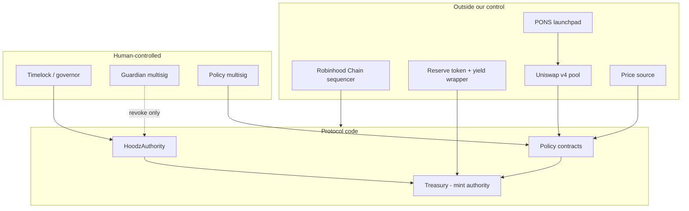

# Hoodz — Security

> # UNAUDITED
>
> **No contract in this repository has been audited by anyone.** It is a from-scratch
> re-implementation of Olympus DAO written for study. Olympus's audits cover Olympus's code, not
> this code — the two share a design, not a single line of bytecode.
>
> Do not deploy this with value at risk until it has had a full professional audit *and* the
> findings have been fixed and re-reviewed. This document exists to make that audit possible and to
> tell you honestly what you would be signing up for.

**Contents**

1. [Scope and status](#1-scope-and-status)
2. [Threat model](#2-threat-model)
3. [Known deltas versus the audited Olympus code](#3-known-deltas-versus-the-audited-olympus-code)
4. [What a real audit must cover](#4-what-a-real-audit-must-cover)
5. [Emergency procedures](#5-emergency-procedures)
6. [Operational security](#6-operational-security)
7. [Monitoring and alerting](#7-monitoring-and-alerting)
8. [Responsible disclosure](#8-responsible-disclosure)

---

## 1. Scope and status

| Component                                      | Status                                  |
| ---------------------------------------------- | --------------------------------------- |
| `contracts/src/**` — all Solidity               | **Unaudited. No formal review.**        |
| `contracts/script/**` — deploy scripts          | Unaudited. Runs with a deployer key.    |
| `web/`, `app/` — frontends                      | Unaudited. Static, no backend.          |
| PONS launchpad, Uniswap v4, Robinhood Chain     | **Third-party. Out of our control.**    |
| The reserve token and its yield wrapper         | **Third-party. A hard dependency.**     |

Two of those rows deserve emphasis. Hoodz's safety depends on external systems it does not
control and did not review: the launchpad that graduates the token, the AMM that prices it, the
chain that sequences it, and the stablecoin whose value the whole notion of "backing" is defined
in. A flawless Hoodz on a broken reserve asset is a broken protocol.

---

## 2. Threat model

### 2.1 What is at risk

| Asset                        | Loss scenario                                                        | Severity  |
| ---------------------------- | -------------------------------------------------------------------- | --------- |
| Treasury reserves            | Drained via `withdraw`/`manage`, or a bad permission grant             | Critical  |
| **Mint authority**           | Unbounded HOOD issuance — every other asset becomes worthless          | Critical  |
| Staking index integrity      | Index manipulated or rolled back; every sHOOD↔gHOOD conversion wrong   | Critical  |
| Hoodz Loans collateral        | gHOOD seized, or loans issued far above collateral value               | High      |
| The locked LP position       | Liquidity removed from a pool that was promised to be permanent        | High      |
| Bond / CD / emission pricing | HOOD minted below backing, permanently dilutive                        | High      |
| Governance control           | A hostile proposal reaches the timelock and executes                   | High      |
| Rebase availability          | Rewards halt (bad, but solvency is untouched)                          | Medium    |

The ranking is deliberate. **Mint authority is the whole system.** Every guard, delay and two-step
handover in the codebase exists to protect that one capability.

### 2.2 Actors and what we assume about them

| Actor                | Assumed                                            | Not assumed                          |
| -------------------- | -------------------------------------------------- | ------------------------------------ |
| `governor` (timelock)| Passes only proposals the DAO voted for            | That the DAO always votes wisely      |
| `guardian`           | Available fast; can only revoke and shut down      | Honest — a hostile guardian can halt but not steal |
| `policy`             | Operates markets within governance-set bounds      | Honest — must be bounded in code, not by trust |
| `vault` (treasury)   | Mints only against reserves it holds               | —                                     |
| Keepers              | Will call `rebase()`, emissions, YRF for the bounty | That any specific keeper is online   |
| Bonders / stakers    | Rational, adversarial, well-capitalised            | Honest                                |
| Borrowers            | Will default whenever it is profitable to          | Honest                                |
| Sequencer            | Can reorder and delay, cannot forge                | Censorship-resistant or always live   |
| Price source         | **The weakest link.** See §3.3.                    | Accurate, manipulation-resistant      |

The `governor`/`guardian` asymmetry is the core defence: the fast key can stop things and cannot
start them. A compromised guardian is a denial of service. A compromised governor is a total loss.
Treat them accordingly — the guardian can be a smaller, faster multisig precisely because its blast
radius is bounded.

### 2.3 Trust boundaries



Every arrow crossing into `Code` is an assumption. The ones from `External` are assumptions you
cannot fix with better Solidity.

### 2.4 Attack surface, by module

**Tokens**
- Precision loss in the gons↔balance conversions; a rounding direction that favours the user
  repeatedly and drains the last wei-holders.
- `sHOOD.setIndex` callable after the first rebase would rewrite history. It must be single-use.
- `gHOOD.migrate` callable twice would re-point minting authority.
- gHOOD's `ERC20Votes` checkpoints: a wrong `_update` override breaks delegation accounting, and
  therefore governance.

**Staking**
- Rebase front-running: stake immediately before a rebase, capture it, unstake. Warmup is the
  mitigation; a zero warmup on mainnet is a live exploit.
- `epoch.distribute` computed from a balance the attacker can influence by donating sHOOD to the
  staking contract.
- Re-entrancy through a hostile recipient on unstake.
- `firstEpochTime` in the past causing multiple epochs to roll in a single call.

**Treasury**
- A permission granted to the wrong address, ever, is a drain.
- `tokenValue` mispricing an asset — especially an LP token — inflates `excessReserves()`, which
  inflates what `mint()` will allow.
- Fee-on-transfer or rebasing reserve tokens breaking the `amount in == amount credited` assumption.
- Donation attacks: sending assets directly to the treasury to move an accounting figure.
- The permission queue's delay being bypassable by re-queuing, or `execute()` being callable on a
  stale index.

**Bonds**
- Control-variable tuning that can be driven to a price below backing.
- Debt decay arithmetic manipulated by timestamp granularity on an L2.
- `maxPayout` not actually bounding a single deposit.
- A market opened by `policy` with parameters outside any on-chain bound.

**Hoodz Loans**
- **The core invariant: oLTC drip rate ≥ interest accrual rate.** If it can ever be violated —
  including transiently, including by a governance parameter change — "no liquidations" becomes
  false and positions can go underwater with no liquidation mechanism to recover them. This is the
  single highest-value thing to verify in the module.
- Governance lowering the oLTC faster than any bound allows, squeezing existing borrowers.
- Interest accrual rounding that lets a borrower pay less than 0.5%.
- Collateral released before debt is fully repaid, in any code path.

**Emissions Manager**
- A manipulated price makes `premium` arbitrarily large, and `emission = supply * baseRate *
  premium / minPremium` is **linear in the premium with no upper bound in the formula itself**. An
  absolute per-period emission cap must exist in code.
- `backing` drifting from reality after each sale, so the premium is computed against a stale
  figure.
- Emitting while the premium is negative because of a signedness or ordering bug.

**YRF**
- Yield computed from a configured APY rather than measured from the wrapper — lets it spend
  principal.
- Repurchasing at a price it does not sanity-check, so a manipulated pool sells it worthless HOOD.

**Convertible Deposits**
- Conversion price stale relative to spot, letting a depositor convert at a discount instead of a
  premium.
- ERC4626-style inflation/first-depositor attack on the deposit token wrapper.
- Reclaim callable before expiry, or conversion callable after it.
- ERC721 position transferred mid-conversion, so the same position converts twice.

**PONS integration**
- **The single unguarded mint.** Before the `vault` role moves to `HoodzLaunchGuard`, the launch
  operator holds it and can mint anything. Every guarantee the guard provides is worth nothing if
  the role is left on the operator key, or if the launch supply differs from the published number.
  This window is the highest-risk moment of the entire project's life.
- `HoodzLaunchGuard` holding `vault` but exposing any path that mints, delegatecalls, or forwards a
  call to HOOD. The guard's security property is the *absence* of a mint function; anything that
  reintroduces one defeats the freeze.
- `graduated` and the LP-lock check sourced from launchpad/locker calls that can be spoofed, or
  that pass against a locker whose interface differs from the one assumed at compile time.
  `verifyGraduation()` must fail closed on every branch.
- `releaseToTreasury()` sending the role anywhere other than the immutable `TREASURY`, or
  succeeding without asserting that `authority.vault()` actually changed.
- The 48-hour `TRANSFER_DELAY` being shortenable, restartable in a way that skips the wait, or
  bypassable by re-arming.
- `abort()` reachable by anyone other than `guardian`, or unable to stop a release once armed.
- **A compromised or unavailable governor.** While the vault role is escrowed with the launch guard
  `pushVault` reverts outright, so a compromised governor cannot reach mint authority. Once released,
  the governor holds `pushVault` on `HoodzAuthority`,
  which is what allows a corrected guard to replace a broken one — and also means the guard cannot
  protect against a hostile governor. A governor address nobody controls bricks the launch with
  supply already frozen. This is an accepted design trade-off; see §3.4.
- `FeeRouterBuyback` holding a balance an attacker can direct, or possessing any withdrawal or
  arbitrary-call path. It must be able to do exactly two things: buy HOOD, and burn it.
- Sandwiching the buyback, which is predictable in size and timing. `minOut == 0` must be rejected
  and `deadline` must be short.

---

## 3. Known deltas versus the audited Olympus code

Every item below is somewhere Olympus's auditors' work does **not** transfer. This list is the
starting point for a Hoodz audit.

### 3.1 Language and library

| Delta | Why it matters |
| ----- | -------------- |
| Solidity `^0.8.24` vs Olympus's older pragmas | Checked arithmetic everywhere. Olympus's `SafeMath`-era code had different overflow behaviour at boundaries — and the gons math in sOHM operates near `MAX_UINT256` by design. Every `unchecked` block is a decision that must be re-justified. |
| OpenZeppelin **v5** vs v3/v4 | Different inheritance, different hooks, different errors. |
| `_update` replaces `_beforeTokenTransfer`/`_afterTokenTransfer` | `_update` fires on mint and burn too, with `from`/`to` as zero. Logic ported from a v4 hook can fire in cases it never fired in before. **A prime source of subtle bugs.** |
| `ERC20Votes` now requires `Nonces` + `_update` + `nonces()` overrides | Getting the override chain wrong silently breaks checkpointing — and therefore governance — without breaking transfers. |
| `Ownable(initialOwner)` is mandatory | Not used on protocol contracts here, but present in any OZ base that inherits it. |
| Custom errors only, no revert strings | Different revert data. Any off-chain tooling or test that matched on strings must be re-checked. |
| `Counters`, `SafeMath`, `draft-ERC20Permit.sol` do not exist in v5 | Anywhere Olympus used them, this repo has a local re-implementation — **new, unreviewed code**. |

### 3.2 Architecture

| Delta | Why it matters |
| ----- | -------------- |
| Single `HoodzAuthority` (Olympus V2 style) rather than Olympus V3's Kernel/modules/policies | Simpler and smaller, but no module upgradeability and no Kernel-level policy activation. Migration paths that Olympus V3 has, Hoodz does not. |
| Treasury permission queue measured in **seconds**, not blocks | A deliberate change. Robinhood Chain's block cadence is not Ethereum's, so a block-denominated delay would silently become a different wall-clock delay. The change is correct and it is still a change: every assumption Olympus's reviewers made about that queue must be re-derived. |
| Hoodz Loans is modelled on Cooler V2's *semantics*, not ported line by line | The oLTC drip and the no-liquidation guarantee are re-derived, not inherited. |
| Emissions Manager, YRF and CD are re-implementations from their published designs | These are Olympus's newest modules and had the least time in production even there. |
| No migrator contracts, no v1→v2 paths | Less code, less surface. Also: no rescue hatch if a token needs replacing. |

### 3.3 Chain — Robinhood Chain is not Ethereum L1

This is the delta most likely to be underestimated.

| Delta | Why it matters |
| ----- | -------------- |
| **Price source** | Olympus reads Chainlink feeds with moving averages. Whatever Hoodz reads on Robinhood Chain is different, newer, and less battle-tested. The Emissions Manager mints in proportion to a price. **This is the highest-risk single dependency in the protocol.** A spot AMM read is not acceptable; a TWAP over a thin pool is barely better. |
| Sequencer reordering and delay | Rebase front-running, bond sniping and buyback sandwiching all behave differently under a single sequencer than under L1 mempool dynamics. |
| Reorg depth and finality | L2 finality is not L1 finality. Deployment scripts and off-chain accounting must wait for the chain's actual finality guarantee, not one confirmation. |
| Block time and `block.timestamp` granularity | Bond debt decay, epoch boundaries and the oLTC drip are all per-second. Verify the chain's timestamp behaviour rather than assuming 12 seconds. |
| Bridged reserve asset | If the reserve is bridged, the bridge is part of the threat model. Backing is denominated in it. |
| Thin liquidity | Every AMM-dependent mechanism — emissions sales, YRF repurchases, the fee buyback — is easier to manipulate in a shallow pool than in a deep one. Slippage bounds are not optional. |
| Uniswap **v4** rather than v2/v3 | Concentrated liquidity and hooks. The `2 * sqrt(k)` risk-free-value identity Olympus used for v2 LP **does not hold**. Using it anyway overstates backing → overstates excess reserves → over-mints. |

### 3.4 New code with no Olympus analogue

The entire `contracts/src/pons/` directory is novel. No Olympus auditor has ever looked at anything
like it:

* `PonsLaunchConfig` — immutable launch parameters. No setter, no owner, no upgrade path. A typo
  is permanent and is only fixable by abandoning the deployment.
* `HoodzLaunchGuard` — **holds the `vault` role** between the launch mint and the handover, freezing
  supply by having no mint function; then verifies graduation and the permanent LP lock, waits out
  a compiled-in 48-hour delay, and pushes `vault` to an immutable treasury address. **A guard that
  can be bypassed is worse than no guard**, because the runbook trusts it.
* `IPositionLocker` — the assumption that the graduated LP position is locked forever. If the live
  locker's interface differs from the one assumed at compile time, the check can pass against
  something that is not a permanent lock.
* `FeeRouterBuyback` — holds value and trades on an AMM. Value-holding, AMM-touching, new.
* The launch flow itself: bonding curve → graduation → permanently locked v4 pool.

Two accepted limitations of the guard, recorded deliberately rather than discovered later:

* **It does not protect the pre-graduation mint.** The launch supply is whatever the operator
  minted at step 3, before the guard held anything.
* **It does not survive a compromised governor.** The governor can push `vault` directly on
  `HoodzAuthority`, bypassing the guard entirely. That escape hatch is what lets a broken guard be
  replaced; it is also the guard's ceiling. The guard raises the cost of a mistake, not the cost of
  a betrayal.

### 3.5 Mechanism

| Delta | Why it matters |
| ----- | -------------- |
| Buyback funded by external trading fees | Olympus has no equivalent. New value path, new assumptions. |
| Permanent, unconditional LP lock | No unlock, no timelock, no override. **Accepted risk, recorded here deliberately** — if that pool is ever wrong, it is wrong forever. |
| Launch by bonding curve rather than by bond markets into a seeded pool | Different early-price dynamics and a different distribution. |

---

## 4. What a real audit must cover

A minimum scope. An auditor should expand it, not trim it.

### 4.1 By module

**Tokens**
- Gons arithmetic: overflow at `TOTAL_GONS`, precision loss, rounding direction on every path.
- `index()` is monotonically non-decreasing under every reachable sequence of calls.
- `setIndex` and `gHOOD.migrate` are genuinely single-use.
- sHOOD↔gHOOD round-trips do not leak value in either direction.
- `circulatingSupply()` cannot be manipulated by donation or by transfers to the staking contract.
- `ERC20Votes` checkpointing is correct across mint, burn and transfer, given the v5 `_update`
  override chain.

**Staking and distribution**
- Warmup cannot be bypassed; rebase front-running is not profitable at the configured warmup.
- `epoch.distribute` cannot be inflated by donating sHOOD or HOOD to the staking contract.
- Reward minting is genuinely capped by `excessReserves()` on every path.
- Epoch boundaries under L2 timestamp behaviour, including a `firstEpochTime` in the past.
- Re-entrancy on stake, unstake, claim and the bounty payment.

**Treasury**
- The permission matrix: enumerate every capability and confirm the guardian can only revoke.
- The queue delay cannot be shortened, re-queued around, or executed on a stale index.
- `tokenValue` for every supported asset, especially LP tokens on **Uniswap v4**.
- `excessReserves()` cannot be inflated by donation, by mispricing, or by a fee-on-transfer token.
- `manage()` cannot move more than excess, on any path, including re-entrant ones.

**Bonds**
- Bond price cannot fall below backing under any tuning sequence.
- Debt decay and `maxPayout` bound a single transaction and a single block.
- Control-variable tuning converges and cannot be driven adversarially.

**Hoodz Loans**
- **The oLTC drip ≥ interest rate invariant, proven, including across governance parameter
  changes.** If this can be violated, the no-liquidation design is unsound. Formal verification or
  an exhaustive invariant test is appropriate here.
- Interest accrual rounding always favours the protocol.
- Collateral accounting on partial repayment, partial withdrawal and default.
- Bounds on how fast governance can lower the oLTC.

**Emissions Manager**
- **An absolute cap on emission per period, independent of the premium.** The formula is linear in
  the premium; the code must not be.
- Price source manipulation cost analysis, at realistic Robinhood Chain liquidity.
- `backing` bookkeeping stays consistent with the treasury's actual state after every sale.
- Behaviour at premium exactly equal to the minimum, and at zero and negative premiums.

**YRF**
- Yield is *measured* from the wrapper, never assumed from a configured rate.
- Principal cannot be spent under any input.
- Repurchase price bounds; the facility refuses obviously manipulated prices.

**Convertible Deposits**
- Conversion price cannot end up below spot.
- No double-conversion via ERC721 transfer, and no conversion after expiry.
- Reclaim accounting, including the fee, is exact.
- Deposit-token wrapper is not vulnerable to inflation/first-depositor attacks.

**PONS integration**
- **`HoodzLaunchGuard` cannot mint, delegatecall, or forward a call to HOOD, on any path.** Its
  entire security property is the absence of a mint function while it holds `vault`. Prove it
  exhaustively.
- `verifyGraduation()` fails closed on every branch, against the *live* launchpad and locker
  interfaces — not the ones assumed at compile time.
- `releaseToTreasury()` can only ever send the role to the immutable `TREASURY`, re-checks every
  precondition in the same block, and asserts the handover actually landed.
- `TRANSFER_DELAY` cannot be shortened, skipped, or reset around by re-arming. `abort()` is
  guardian-only and genuinely stops an armed release.
- The LP lock is genuinely permanent — read the deployed position, do not read the documentation.
  Confirm the `lockBeneficiary` can withdraw fees only, never principal.
- `FeeRouterBuyback` has no withdrawal path, no arbitrary-call path, burns in the same transaction
  as the buy, rejects `minOut == 0`, and enforces `deadline`.

### 4.2 Cross-cutting

- **Access control matrix**: every external function × every role, tabulated and checked.
- **Re-entrancy**: every external call, including ERC721 `onERC721Received` in CD.
- **Non-standard tokens**: fee-on-transfer, rebasing, non-standard-return, non-18-decimal.
- **Upgrade and migration**: what happens when a module must be replaced. There is currently no
  migrator; is that acceptable?
- **Deployment scripts**: they run with a key that briefly holds every role.
- **Frontend**: `/app` must read addresses from the committed manifest and must not be able to be
  pointed at an arbitrary contract by URL parameter.

### 4.3 Economic review — separate from the code audit

A Solidity audit will not catch these. Commission an economic review as well:

- Agent-based simulation of the full loop across bull, flat and bear regimes.
- Bank-run behaviour: mass unstake plus mass Hoodz Loans borrowing at once.
- Is the "soft floor" from Hoodz Loans real at realistic liquidity, or does the loan facility simply
  run out of reserves to lend?
- Emissions plus rebase plus bond issuance simultaneously at maximum configured rates — what is the
  worst-case supply growth the parameters permit?
- Governance attack economics: what does it cost to acquire enough gHOOD to pass a proposal, versus
  what the treasury holds? **If the treasury is worth more than the cost of a governance attack,
  the protocol is not economically secure**, regardless of code quality.

---

## 5. Emergency procedures

### 5.1 Who can do what

| Role       | In an incident                                              | Speed              |
| ---------- | ----------------------------------------------------------- | ------------------ |
| `guardian` | **Revoke permissions, pause and shut down policies.** Cannot grant, cannot move funds. | Immediate |
| `policy`   | Close bond markets, zero out market capacity                 | Immediate          |
| `governor` | Everything else — replace contracts, re-grant, change parameters | Timelock delay |

**The guardian is the emergency responder.** It is designed so that using it in a false alarm is
cheap: the worst outcome of an unnecessary guardian action is that yield stops and markets close.
Nothing the guardian can do loses funds. **When in doubt, pull the lever.**

### 5.2 Severity

| Level | Definition                                          | Response                                              |
| ----- | --------------------------------------------------- | ----------------------------------------------------- |
| **P0** | Funds leaving, or unauthorised minting, right now  | Guardian revokes everything. Ask questions afterwards. |
| **P1** | Exploitable, not yet exploited                      | Guardian disables the affected module within minutes.  |
| **P2** | Incorrect behaviour, no direct loss                 | Close affected markets, prepare a governance fix.      |
| **P3** | Cosmetic or informational                           | Normal governance.                                     |

### 5.3 Shutdown paths

| Threat                              | Action                                             | Role     |
| ----------------------------------- | -------------------------------------------------- | -------- |
| A policy contract is draining reserves | `treasury.disable(STATUS, <policy>)`             | guardian |
| The distributor is over-minting     | `treasury.disable(REWARDMANAGER, distributor)` — rebase rewards stop, staking still works | guardian |
| A bond market is mispriced          | `bondDepository.closeMarket(id)`                   | policy / guardian |
| The price source is compromised     | `emissionsManager.shutdown()` **first**, then investigate | guardian |
| The YRF is buying at a bad price    | `yrf.shutdown()` — returns unspent reserves to the treasury | guardian |
| CD conversion terms are wrong       | Pause the auctioneer / set daily capacity to zero  | guardian |
| Hoodz Loans is issuing bad debt      | `hoodzLoans.emergencyShutdown()` — **stops new lending only**; existing borrowers can still repay and reclaim collateral | guardian |
| The fee router is being sandwiched  | Pause `FeeRouterBuyback`, or simply stop calling `buybackAndBurn` — nothing accumulates between calls | guardian / policy |
| A mint-authority release was armed in error, or graduation is disputed | `hoodzLaunchGuard.abort()` — cancels the pending release and resets the 48-hour clock | guardian |
| A role key is compromised           | `governor` pushes a new address for that role      | governor (timelock delay) |
| **The governor key is compromised** | The guardian revokes every treasury permission it can reach, buying time until the timelock delay expires | guardian |

Illustrative form — confirm the exact signature against the deployed ABI before you need it:

```bash
# revoke a permission, instantly
cast send $TREASURY "disable(uint8,address)" $STATUS $BAD_ADDRESS \
  --rpc-url robinhood --account hoodz-guardian

# stop the emissions manager
cast send $EMISSIONS "shutdown()" --rpc-url robinhood --account hoodz-guardian

# close a bond market
cast send $BOND_DEPO "closeMarket(uint256)" $MARKET_ID --rpc-url robinhood --account hoodz-policy
```

**Rehearse these on testnet.** A guardian multisig that has never signed a shutdown will not
successfully sign its first one during an incident, at 3am, under pressure. Rehearsal is part of
the deployment checklist in [`DEPLOYMENT.md`](DEPLOYMENT.md) for exactly this reason.

### 5.4 The first fifteen minutes

1. **Contain.** Guardian disables the affected module. Do not wait for consensus on the diagnosis.
2. **Assess.** Is HOOD still minting? Are reserves still leaving? Those two questions first.
3. **Broaden.** If the vector could reach other modules, disable those too. Over-containing costs
   yield; under-containing costs the treasury.
4. **Communicate.** Say what is known and what is not. Do not publish exploit details while a fix
   is un-deployed.
5. **Preserve.** Record block numbers, transaction hashes and the full state before anything is
   changed.
6. **Then** start the governance process for the real fix.

### 5.5 What cannot be shut down

Be clear-eyed about this list — it is the residual risk after every lever has been pulled.

* **HOOD transfers.** There is no pause and there will never be one: PONS requires a clean
  permissionless ERC20, and a currency with a pause switch is not a currency. If HOOD itself is
  broken, there is no lever.
* **The locked LP position.** Permanent means permanent. No unlock, no timelock, no governance
  override. This is an **accepted risk**, not an oversight.
* **The sHOOD rebase mechanism.** Halting the distributor stops new rewards; the index cannot be
  rolled back.
* **Bonds already vesting.** Existing positions vest and redeem regardless.
* **Existing loan positions.** By design: shutting down Hoodz Loans stops *new* lending. Borrowers
  keep the right to repay and reclaim their collateral, always. Seizing collateral in an emergency
  would break the guarantee the whole product rests on.
* **Anything already stolen.** There is no clawback.

### 5.6 After the incident

* Full public post-mortem: timeline, root cause, funds affected, fix, and what changes so it cannot
  recur.
* Independent review of the fix before it is deployed. The team that wrote the bug is the worst
  team to certify the patch.
* Re-audit the affected module.
* Update this document with the new failure mode.

---

## 6. Operational security

**Keys**
- Mainnet deployment from a hardware wallet or a Foundry keystore. **Never a raw key in `.env`.**
- Guardian and governor signers on separate hardware, in separate physical locations, in separate
  jurisdictions where practical.
- `.env` is gitignored. `broadcast/` is gitignored. Verify before every push.
- The deployer EOA holds no role once [`DEPLOYMENT.md`](DEPLOYMENT.md) §9.6 is complete. Prove it
  by calling a governor-only function from it and watching it revert.

**Multisigs**
- Guardian: small and fast. 3-of-5 is reasonable. Its blast radius is bounded by design, which is
  what lets it be fast.
- Governor: a timelock, held by the DAO. The delay is the security property — do not shorten it
  for convenience.
- Publish signer sets. Rotate on any departure. Rehearse signing quarterly.

**Process**
- Two people for every mainnet transaction. One drives, one reads addresses aloud.
- Simulate before broadcasting. Every time.
- One policy change at a time, with observation between them.
- Never deploy on a Friday, and never deploy tired.

---

## 7. Monitoring and alerting

Alerts, not dashboards. Every line below should page a human.

| Signal                                              | Threshold                       | Severity |
| --------------------------------------------------- | ------------------------------- | -------- |
| `HOOD.totalSupply()` jumps                          | > expected epoch issuance       | **P0**   |
| Any `Transfer` from `address(0)` not from the treasury | any                          | **P0**   |
| `authority.vault()` changes                         | any                             | **P0**   |
| `HOOD.totalSupply()` changes while the guard holds `vault` | ever — this must be impossible | **P0** |
| `hoodzLaunchGuard.arm()` is called                   | any                             | **P1**   |
| `authority.governor()` / `guardian()` / `policy()` changes | any                      | **P0**   |
| A treasury permission is granted                    | any                             | **P1**   |
| `treasury.excessReserves()` falls sharply           | > 10% in one epoch              | **P1**   |
| `staking.index()` decreases                         | ever                            | **P0**   |
| Price source deviates from the AMM                  | > 5%                            | **P1**   |
| Emission in a single period                         | > the configured absolute cap   | **P1**   |
| oLTC drip rate < interest accrual rate              | ever                            | **P0**   |
| LP lock state changes                               | ever                            | **P0**   |
| A rebase is missed                                  | > 1 epoch late                  | **P2**   |
| `FeeRouterBuyback` holds a non-zero idle balance    | sustained                       | **P2**   |

The two that people forget to instrument are **index monotonicity** and the **oLTC drip
invariant**. Both are silent until they are catastrophic.

---

## 8. Responsible disclosure

**There is currently no security contact for this repository.** It is unaudited, undeployed
educational code, and no bug bounty exists.

Before any deployment that holds value, governance must publish:

1. A monitored security contact and a PGP key.
2. A disclosure policy with a stated response time.
3. A funded bug bounty, scaled to the treasury it protects.
4. The guardian multisig's signer set and its rehearsed response procedure.

Until all four exist, treat this repository as what it is: a study of a protocol, not a protocol.

If you have found a vulnerability in this code as it stands, open a normal issue — nothing here is
deployed, so there is nothing to disclose privately.

---

## 9. Adversarial review, 26 August 2026

A four-lens automated review (accounting, access control, reentrancy, PONS) produced 20 findings.
Six were high severity. All six are fixed; the rest are recorded here as known and open.

### Fixed

| Severity | Where | What was wrong |
| -------- | ----- | -------------- |
| High | `tokens/gHOOD.sol` | `INDEX_SCALE` was `1e9` instead of `10**decimals()` (`1e18`), so `balanceFrom`/`balanceTo` were off by 1e9 against the 18-decimal denomination. Every absolute constant written in gHOOD terms broke: the governor's 1,000 gHOOD proposal threshold became unreachable for **every** account forever, and the Clearinghouse oLTC was mis-scaled by the same factor. Round-trips stayed self-consistent, which is why relative-only tests missed it. |
| High | `tokens/sHOOD.sol` | `circulatingSupply()` omitted the sHOOD parked in staking warmup, so `HoodzStaking.rebase()` read every warmup deposit as distributable surplus and paid it to existing stakers. The depositor's principal was then unbacked and permanently unrecoverable once others unstaked. Only reachable with a non-zero warmup, which the deploy script supports. |
| High | `HoodzAuthority.sol` | `pushVault` was plain `onlyGovernor` and never consulted the launch guard, so the governor could hand mint authority to the treasury in one transaction and skip graduation entirely. The guard was decorative. |
| High | `pons/HoodzLaunchGuard.sol` | `releaseToTreasury()` was unreachable in every possible deployment: it is `onlyGovernor` on the guard **and** called `HoodzAuthority.pushVault`, which is `onlyGovernor` on the authority. The guard would have had to be the governor and not be the governor at the same time. |
| High | `loans/Clearinghouse.sol` | `claimDefaulted` checked only that the escrow came from the trusted factory, never that this policy was the loan's lender. A keeper could point it at defaults on someone else's loans and collect a gHOOD reward out of our balance for collateral we never receive. |
| High | `loans/Cooler.sol` | `clearRequest` called the lender-supplied `ICoolerCallback.isCoolerCallback()` hook **before** deactivating the request, so a malicious lender could re-enter and clear the same request twice — two loans against one lot of collateral. |

The first four are fixed by a single design change plus one constant:

* `HoodzAuthority.lockVaultToGuard(guard)` — governor-only, one-shot. Installs the guard as the
  vault (freezing supply, since the guard has no mint function) **and disables `pushVault`**.
* `HoodzAuthority.releaseVaultFromGuard(newVault)` — callable only by the registered guard, so
  `msg.sender` is the guard contract while the human governor calls `releaseToTreasury()`. No
  deadlock, and no bypass.

### Known and open

Four medium findings are recorded but not fixed, because each is a governance-trust question rather
than a bug an attacker can reach unaided:

* `Distributor.setAdjustment` — a downward ramp whose target sits *above* the current rate snaps the
  rate to the target on the first `_adjust`, defeating the guardian's 2.5% step limiter.
* `NoteKeeper.addNote` — books the note's gHOOD payout at the pre-rebase index while the staking
  call that follows mints at the post-rebase index, so epoch-straddling bonds are over-credited by
  roughly one epoch's rebase.
* `HoodzTreasury.tokenValue` — prices an ERC-4626 savings-vault share at face value.
* `pons/FeeRouterBuyback.buybackAndBurn` — spends the whole reserve balance measured at execution
  time against a `minOut` chosen at signing time.

Plus three low findings: permissionless `redeem` of another account's matured note, a 1-wei stake
that resets a locked account's warmup clock, and `push*` events reporting the new holder in the
`from` field. **An audit must revisit all of these.**
