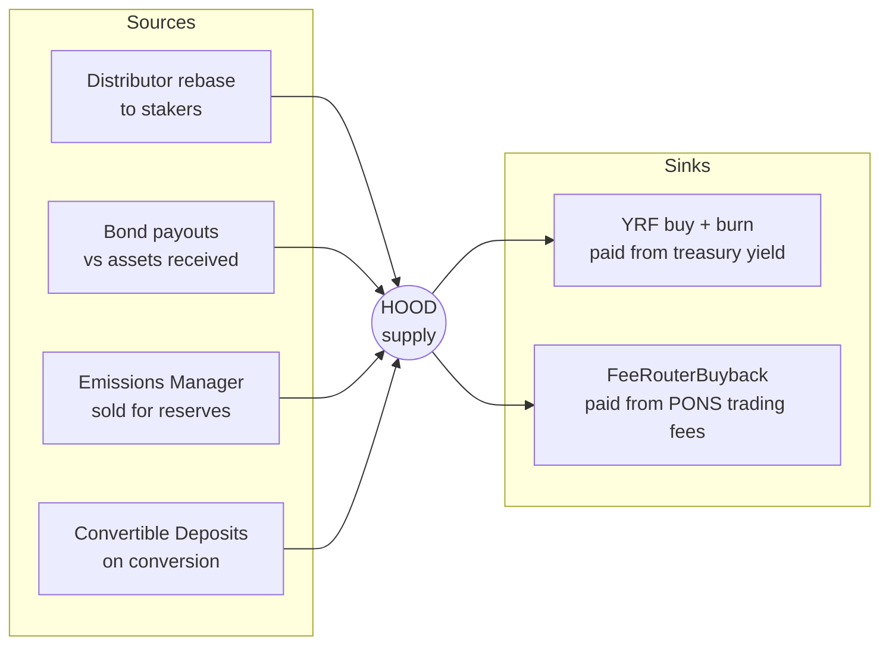

# Hoodz — Tokenomics

> **UNAUDITED.** Every number in this document is an *illustrative* parameter or a worked example.
> None of it is a projection, a promise, or investment advice. See [`SECURITY.md`](SECURITY.md).

This document is the arithmetic behind [`PROTOCOL.md`](PROTOCOL.md). It answers four questions:

* Where does HOOD supply come from, and where does it go?
* What is "backing", how does it differ from price, and which one does the protocol control?
* Who is diluted by emissions, and by how much?
* What does the PONS-fee buyback loop actually contribute?

Every example uses the same base case so the numbers compose.

**Contents**

1. [Notation and the base case](#1-notation-and-the-base-case)
2. [The supply model](#2-the-supply-model)
3. [The rebase: yield, leverage and runway](#3-the-rebase-yield-leverage-and-runway)
4. [Backing versus price](#4-backing-versus-price)
5. [RFV and treasury valuation](#5-rfv-and-treasury-valuation)
6. [Dilution from emissions](#6-dilution-from-emissions)
7. [Bonds and convertible deposits, numerically](#7-bonds-and-convertible-deposits-numerically)
8. [Buyback and burn, funded by PONS fees](#8-buyback-and-burn-funded-by-pons-fees)
9. [A full day, all mechanisms at once](#9-a-full-day-all-mechanisms-at-once)
10. [A full year, and why emissions self-limit](#10-a-full-year-and-why-emissions-self-limit)
11. [The contraction case](#11-the-contraction-case)
12. [What this model does not promise](#12-what-this-model-does-not-promise)
13. [Reading the real numbers on-chain](#13-reading-the-real-numbers-on-chain)

---

## 1. Notation and the base case

| Symbol | Meaning                                                     |
| ------ | ----------------------------------------------------------- |
| `S`    | Circulating HOOD supply                                      |
| `R`    | Liquid treasury reserves, in reserve-token units             |
| `b`    | Backing per HOOD = `R / S`                                   |
| `p`    | Market price of HOOD in reserve units                        |
| `π`    | Premium = `p / b - 1`                                        |
| `i`    | Staking index (starts at 1.0, only rises)                    |
| `r`    | Distributor reward rate per epoch                            |

**Base case used throughout** (all values are **illustrative parameters**, not commitments):

| Quantity                     | Value            |
| ---------------------------- | ---------------- |
| Supply `S`                   | 10,000,000 HOOD  |
| Reserves `R`                 | 100,000,000      |
| Backing `b`                  | 10.00            |
| Price `p`                    | 12.00            |
| Premium `π`                  | 20%              |
| Staked                       | 7,000,000 (70%)  |
| Epoch                        | 8 hours → 1,095/year |
| Reserve yield                | 6% APY           |
| Index `i`                    | 100              |

Decimals mirror Olympus: HOOD and sHOOD are 9-decimal, gHOOD is 18-decimal
(`docs/pons-launch.json` → `token.decimals` = `9`). The token contracts in
`contracts/src/tokens/` are the source of truth; if they disagree with this line, they win.

---

## 2. The supply model

HOOD supply has exactly four sources and two sinks. Nothing else can change it.



The master equation, per period:

```
ΔS = rebase + bondPayouts + emissions + conversions - yrfBurn - feeBurn
ΔR = bondProceeds + emissionProceeds + cdDeposits + loanInterest + reserveYield - yrfSpend
Δb = (R + ΔR)/(S + ΔS) - R/S
```

The only term in `ΔS` that adds **no** reserves is the rebase. That is the whole reason every other
mechanism exists: they exist to outrun it.

### 2.0 Genesis supply

None of the six terms above apply before the protocol is live. The initial supply comes from a
**single mint**, signed by the launch operator, before HOOD ever trades — the amount is published
in `docs/pons-launch.json` (`token.launchSupply`) along with its transaction hash.

Between that mint and the moment mint authority reaches the treasury, **supply is frozen**: the
`vault` role sits on `HoodzLaunchGuard`, which has no mint function. So the entire price-discovery
period on the PONS bonding curve happens against a fixed, published, verifiable supply. There is no
stealth issuance to model, because there is no issuance at all.

`token.supplyRetained` — supply not sold on the curve — should be **zero** for a clean launch.
Every retained token is a claim the market will price in, and it is the first number a sceptical
reader will look for.

Everything from §3 onward assumes the protocol is live and the treasury holds mint authority.

### 2.1 Is each source accretive?

| Source                | Adds reserves? | Mints at a price…            | Net effect on `b`         |
| --------------------- | -------------- | ---------------------------- | ------------------------- |
| Distributor rebase    | No             | n/a — pure issuance          | **Down**                  |
| Bond payout           | Yes            | below spot, above backing    | **Up** (by the `profit`)  |
| Emissions Manager     | Yes            | at market, above backing     | **Up**                    |
| Convertible Deposit   | Yes            | above spot, well above backing | **Up** (strongly)       |
| YRF burn              | Spends yield only | n/a                       | **Up**                    |
| PONS fee burn         | No treasury cost | n/a                        | **Up** (free)             |

A protocol running only the first row shrinks its backing every epoch and eventually stops. A
protocol running all six rows can grow supply *and* backing simultaneously. Section 9 does exactly
that, with numbers.

---

## 3. The rebase: yield, leverage and runway

### 3.1 Reward rate to APY

The distributor mints `r * totalSupply` each epoch. With 1,095 epochs a year, compounding is
brutal at the top end:

| `r` per epoch | Per day  | APY          |
| ------------- | -------- | ------------ |
| 0.010%        | 0.0300%  | **11.57%**   |
| 0.020%        | 0.0600%  | **24.48%**   |
| 0.050%        | 0.1501%  | **72.87%**   |
| 0.100%        | 0.3003%  | **198.75%**  |
| 0.200%        | 0.6012%  | **791.57%**  |
| 0.300%        | 0.9027%  | **2,557.80%**|
| 0.500%        | 1.5075%  | **23,441.69%** |

Those four-digit numbers are a supply-growth schedule, not a return. A 2,557% APY means supply is
26× larger in a year. Whether a staker is better off depends entirely on whether backing and price
kept up — which, at that rate, they will not. Modern Olympus wound its rebase down to near zero and
moved growth to the Emissions Manager, and Hoodz should be operated the same way.

### 3.2 Staking-ratio leverage

The reward is computed on **total** supply and paid to **staked** supply, so the effective rate for
a staker is `r / stakingRatio`:

| Staked share | Nominal `r` | Effective `r` for a staker | Staker APY |
| ------------ | ----------- | -------------------------- | ---------- |
| 30%          | 0.050%      | 0.1667%                    | 519.3%     |
| 50%          | 0.050%      | 0.1000%                    | 198.8%     |
| 70%          | 0.050%      | 0.0714%                    | 118.6%     |
| 90%          | 0.050%      | 0.0556%                    | 83.7%      |

This is a self-balancing incentive: the fewer people staked, the more it pays to stake. It is also
the reason headline APY falls as the protocol matures even when governance changes nothing.

### 3.3 A concrete 30-day stake

Stake 100 HOOD at `i = 1.000000` with `r = 0.1%` per epoch, hold for 30 days (90 epochs):

```
sHOOD balance = 100 * 1.001^90 = 109.412508 sHOOD
index         = 1.094125
gHOOD balance = 100 / 1.0 = 100 gHOOD, unchanged the entire time
```

The sHOOD holder watched a number grow. The gHOOD holder watched `index()` grow. They hold
identical claims — 109.412508 sHOOD is exactly 100 gHOOD at that index.

### 3.4 Runway

Rebase rewards are minted through `treasury.mint()`, which reverts unless covered by excess
reserves. Runway is how long the current rate can be sustained:

**(param)** Excess reserves 20,000,000, supply 10,000,000, backing 10:

| `r` per epoch | Epochs of runway | Days      |
| ------------- | ---------------- | --------- |
| 0.010%        | 1,824            | **608.0** |
| 0.050%        | 365              | **121.7** |
| 0.100%        | 183              | **61.0**  |
| 0.300%        | 61               | **20.3**  |

When runway hits zero the rebase stops. It does not become insolvent, it does not liquidate anyone,
it simply pays nothing until reserves recover. Runway is therefore the number governance should be
watching, not APY.

---

## 4. Backing versus price

**Backing is an accounting fact. Price is an opinion.** The protocol controls the first and does
not control the second.

```
b = R / S            controlled: the protocol decides what it holds and how much it issues
p = whatever the AMM says     not controlled: no oracle, no peg, no defence
π = p / b - 1        the input every policy module reads
```

### 4.1 What each regime does

| Regime            | Emissions Manager | YRF        | Fee buyback | Net effect                       |
| ----------------- | ----------------- | ---------- | ----------- | -------------------------------- |
| `π` above minimum | **Sells HOOD**    | buys+burns | buys+burns  | Reserves grow fast, supply grows |
| `π` below minimum | **Silent**        | buys+burns | buys+burns  | Supply shrinks, backing rises    |
| `p < b` (discount)| Silent            | buys+burns *more HOOD per reserve* | same | Fastest backing growth per token |

The asymmetry is intentional. Selling into strength and buying into weakness is the only policy a
protocol can run without an oracle and without a treasury large enough to defend a peg.

### 4.2 The soft floor from Hoodz Loans

Hoodz has **no redemption mechanism** — you cannot hand HOOD to the treasury for reserves. But
Hoodz Loans creates something close to one.

At `i = 100` and `b = 10`, one gHOOD is backed by 1,000 reserve. **(param)** With the oLTC at 95%
of that, a holder can borrow **950 reserve per gHOOD** — the equivalent of selling at 9.50 per HOOD
— at 0.5% per year, with no liquidation, while keeping the collateral and all of its upside.

For a holder who wants liquidity, borrowing at 9.50 dominates selling at anything below it. That
places a soft floor under the market price at roughly `oLTC × backing`, enforced not by protocol
intervention but by the fact that selling below it is irrational. It is soft because it depends on
the loan facility having reserves to lend and on the borrower valuing the upside — neither is
guaranteed.

---

## 5. RFV and treasury valuation

Three valuations of the same treasury:

| Valuation | Method                                         | Used for                    |
| --------- | ---------------------------------------------- | --------------------------- |
| **TMV**   | every asset at spot, LP at spot                | headline reporting only     |
| **RFV**   | stables at par, LP at its constant-product floor | the conservative number   |
| **Liquid backing** | RFV minus illiquid assets, minus protocol-owned HOOD | policy decisions   |

TMV is the least useful. It includes the HOOD sitting in protocol-owned liquidity, valued at the
HOOD price — so a rising HOOD price makes the treasury look bigger, which makes the backing look
better, which is circular. Liquid backing strips that out.

### 5.1 LP risk-free value

For a constant-product pool, the value if HOOD were worth exactly one reserve unit is:

```
RFV(pool) = 2 * sqrt(reserveHOOD * reserveQuote)
```

**(param)** A pool holding 500,000 HOOD and 6,000,000 reserve, of which the treasury owns 80%:

```
k          = 500,000 * 6,000,000 = 3.0000e12
2*sqrt(k)  = 3,464,101.62
treasury's 80% share:
  RFV               = 2,771,281.29
  market value      = 0.80 * (6,000,000 + 500,000*12) = 9,600,000
```

The gap between 2.77M and 9.60M is precisely the part of the treasury's LP value that would
evaporate if HOOD returned to parity. Counting only the 2.77M is what "risk-free" means.

> **Robinhood Chain caveat.** The graduated PONS pool is **Uniswap v4**, where liquidity can be
> concentrated and the `2*sqrt(k)` identity does not hold. The formula above is the intuition; a
> v4-aware calculator is a hard implementation requirement. Getting this wrong overstates backing,
> which then overstates excess reserves, which then over-mints. It is on the audit list in
> [`SECURITY.md`](SECURITY.md).

### 5.2 Backing per HOOD in full

```
liquid backing = stables at par
               + RFV of LP positions
               + outstanding Hoodz Loans principal
               - HOOD owned by the treasury (valued at 0 for backing purposes)
               - illiquid / long-dated positions

backing per HOOD = liquid backing / (HOOD.totalSupply() - treasury-held HOOD)
```

Outstanding loan principal counts because it is a claim on gHOOD collateral worth at least the
debt (§6.4 of `PROTOCOL.md`). Treasury-held HOOD does not count, in either the numerator or the
denominator — a token cannot back itself.

---

## 6. Dilution from emissions

This is the section people argue about, so here is the arithmetic without editorialising.

### 6.1 One emission event

Base case: `S = 10,000,000`, `R = 100,000,000`, `b = 10`, `p = 12`, `π = 20%`.
**(param)** `minimumPremium = 10%`, `baseEmissionRate = 0.05%` of supply per day.

```
emissionRate = 0.05% * (20% / 10%)   = 0.10% of supply
emission     = 10,000,000 * 0.10%    = 10,000 HOOD
proceeds     = 10,000 * 12           = 120,000 reserve

new S = 10,010,000
new R = 100,120,000
new b = 10.001998        (+0.0200%)
```

### 6.2 Who won and who lost

Take a holder with 100,000 HOOD (1.00% of supply) and follow both cases:

| Holder            | Share before | Share after | Backing claim before | Backing claim after |
| ----------------- | ------------ | ----------- | -------------------- | ------------------- |
| **Unstaked**      | 1.0000%      | 0.9990%     | 1,000,000            | **1,000,200**       |
| **Staked (70% ratio, `r`=0.05%)** | 1.0000% | 1.0000%+ | 1,000,000 | **1,000,200 +** rebase |

The unstaked holder's *share* fell by 0.1%. Their *claim* rose by 200 reserve, because the treasury
grew by more than the supply did. This is the single most important line in the document:

> **Emissions dilute your percentage and increase your claim. They are only bad for you if the
> protocol sells HOOD below backing — and by construction, it cannot.**

The staked holder additionally receives the rebase, which restores their percentage as well.

The genuine cost of emissions is not to the balance sheet. It is to **price**: 10,000 HOOD sold
into the market each day is real sell pressure, and it is the mechanism by which a high premium
gets compressed back toward backing. Emissions trade price appreciation for balance-sheet growth,
deliberately.

### 6.3 The self-limiting property

Every emission moves both terms of the premium against further emission:

* `b` rises (reserves grew faster than supply) → `π = p/b - 1` falls.
* `S` rises and HOOD is sold → `p` tends to fall → `π` falls again.

At `π < minimumPremium` the manager emits nothing. There is no configuration in which it emits
forever. Section 10 shows this over a simulated year.

---

## 7. Bonds and convertible deposits, numerically

### 7.1 A bond

**(param)** 7-day market, `controlVariable = 456`, `totalDebt = 250,000`, `baseSupply = 10,000,000`:

```
debtRatio = 250,000 / 10,000,000 = 0.025
bondPrice = 456 * 0.025          = 11.40      (5.0% below spot of 12)

deposit 10,000 reserve  ->  payout 877.19 HOOD, vesting over 7 days
backing cost of the mint = 877.19 * 10 = 8,771.93
profit banked            = 10,000 - 8,771.93 = 1,228.07 reserve

new b = 100,010,000 / 10,000,877.19 = 10.000123   (+0.0012%)
```

`maxPayout` per 4-hour deposit interval on a 200,000-capacity market is
`200,000 * 4/168 = 4,762 reserve`, so no single buyer can clear the market at the opening price.

### 7.2 A convertible deposit

**(param)** Spot 12, conversion premium 15%, 30-day term, 6% reserve yield, 100,000 reserve
deposited:

```
conversion price = 12 * 1.15 = 13.80
convertible into = 100,000 / 13.80 = 7,246.38 HOOD
```

| Outcome                    | Treasury receives                       | HOOD minted | New backing        |
| -------------------------- | --------------------------------------- | ----------- | ------------------ |
| **Converted** (`p` > 13.80)| 100,000 reserve, permanently             | 7,246.38    | 10.002752 (+0.0275%) |
| **Expired unconverted**    | 1,000 reclaim fee + 493.15 yield         | 0           | slightly up, no dilution |

On conversion the mint costs 72,463.77 of backing against 100,000 received — **+27,536.23 reserve
of net new backing**. On expiry the depositor takes 99,000 back and the treasury keeps 1,493.15 for
having stood ready.

Compare the three issuance channels on the same 100,000 of incoming reserve:

| Channel              | HOOD issued | Net new backing | Issued at    |
| -------------------- | ----------- | --------------- | ------------ |
| Bond (5% discount)   | 8,771.93    | 12,280.70       | 11.40 (below spot) |
| Emission             | 8,333.33    | 16,666.67       | 12.00 (at spot)    |
| Convertible deposit  | 7,246.38    | 27,536.23       | 13.80 (above spot) |

Convertible deposits are the most accretive channel per unit of reserve raised, which is exactly
why the mechanism was invented. They are also the least reliable — the depositor may simply decline
to convert.

---

## 8. Buyback and burn, funded by PONS fees

Everything so far is funded by the protocol or by its depositors. This loop is not: it is funded by
**traders**.

HOOD graduates from the PONS bonding curve into a permanently locked Uniswap v4 pool. That pool
charges a fee on every trade, and a share of it routes to `FeeRouterBuyback`, which buys HOOD on
the pool and burns it.

**(param)** 2,000,000 reserve of daily volume, 1% LP fee, 40% protocol share, price 12:

```
daily fees      = 2,000,000 * 1%   = 20,000 reserve
protocol share  = 20,000 * 40%     =  8,000 reserve
HOOD burned     = 8,000 / 12       =    666.67 HOOD/day
annualised      = 243,333 HOOD     = 2.43% of a 10,000,000 supply
```

Three structural properties:

1. **Zero cost to the protocol.** No treasury asset is consumed. Backing per token rises purely
   because the denominator shrank. This is the only mechanism in Hoodz with that property.
2. **It scales with attention, not with capital.** Volume, not TVL, is the input. A volatile week
   burns more than a quiet month.
3. **It is countercyclical in HOOD terms.** A fixed reserve budget retires more HOOD at a lower
   price. At `p = 8` the same 8,000/day burns 1,000 HOOD instead of 666.67.

Sensitivity of the annual burn as a percentage of a 10,000,000 supply:

| Daily volume | Burn/day @ p=12 | Annual burn | % of supply |
| ------------ | --------------- | ----------- | ----------- |
| 500,000      | 166.67          | 60,833      | 0.61%       |
| 2,000,000    | 666.67          | 243,333     | 2.43%       |
| 5,000,000    | 1,666.67        | 608,333     | 6.08%       |
| 10,000,000   | 3,333.33        | 1,216,667   | 12.17%      |

---

## 9. A full day, all mechanisms at once

Base case, **mature regime**: `r = 0.01%` per epoch (a deliberately low rebase, with growth coming
from emissions instead), 70% staked, everything else as in §1.

| Flow                     | ΔS (HOOD)     | ΔR (reserve) |
| ------------------------ | ------------- | ------------ |
| Distributor rebase       | **+2,100.21** | 0            |
| Emissions Manager        | **+10,000.00**| **+120,000** |
| Reserve yield accrued    | 0             | **+16,438**  |
| YRF spends that yield    | **−1,369.86** | **−16,438**  |
| PONS fee buyback         | **−666.67**   | 0            |
| **Net**                  | **+10,063.68**| **+120,000** |

```
S: 10,000,000  ->  10,010,063.68     (+0.1006% per day)
R: 100,000,000 -> 100,120,000        (+0.1200% per day)
b: 10.000000   ->  10.001935         (+0.0193% per day)
```

Annualised at these rates: **supply +44.36%, backing per HOOD +7.31%.**

That is the whole thesis in two numbers. Supply grows a lot. Backing per token still grows, because
every unit of new supply arrives attached to more than its own weight in reserves. A holder who
does nothing is diluted in percentage terms and better off in claim terms; a holder who stakes is
roughly neutral in percentage terms and better off in claim terms.

Note what is **not** in the table: the market price. Nothing above defends it, and 10,000 HOOD/day
of emission is real, ongoing sell pressure.

---

## 10. A full year, and why emissions self-limit

Iterating §9 daily for 365 days, holding price flat at 12 and letting backing compound:

| Quantity          | Day 0        | Day 365       | Change      |
| ----------------- | ------------ | ------------- | ----------- |
| Supply `S`        | 10,000,000   | 13,408,721    | **+34.09%** |
| Reserves `R`      | 100,000,000  | 141,901,696   | +41.90%     |
| Backing `b`       | 10.00        | **10.5828**   | **+5.83%**  |
| Premium `π`       | 20.0%        | **13.4%**     | −6.6 pts    |

Supply growth came in *below* the naive 44% annualisation from §9, and this is the important part:
**the emission shrank itself.** As backing climbed from 10.00 to 10.58 with price held at 12, the
premium fell from 20% to 13.4%, and `emissionRate = baseRate * π / minimumPremium` fell with it.
Had backing reached 10.91, the premium would have hit the 10% minimum and emissions would have
stopped entirely until the price moved.

The feedback loop is negative in both directions, which is what makes the mechanism a policy rather
than a printer.

---

## 11. The contraction case

Now the uncomfortable one. Price falls to **8**, below the backing of 10. The premium is negative,
so **the Emissions Manager goes silent**. What remains?

Weekly, at `p = 8`, `r = 0.01%`, 70% staked:

| Flow             | ΔS (HOOD)       |
| ---------------- | --------------- |
| Rebase           | +14,701.47      |
| Emissions        | **0**           |
| YRF burn         | −14,383.56      |
| PONS fee burn    | −7,000.00       |
| **Net**          | **−6,682.09**   |

```
S: 10,000,000 -> 9,993,317.91
R: 100,000,000 (principal untouched; only yield was spent)
b: 10.000000  -> 10.006687        (+0.0669% per week, +3.54% annualised)
```

**Supply contracts and backing rises.** The lower price makes both burn mechanisms more efficient,
and the treasury's principal is never touched because the YRF spends only realised yield.

This is the designed behaviour, and it is genuinely robust in balance-sheet terms. It is **not** a
price floor. Three things it does not do:

* It does not stop the price falling. 3.54% a year of backing growth will not absorb a determined
  seller.
* It does not let you redeem. There is no path from HOOD back to reserves except selling to another
  buyer or borrowing through Hoodz Loans.
* It does not protect a leveraged holder. Backing rising per token is no consolation if you sold.

---

## 12. What this model does not promise

Stated plainly, because everything above is arithmetic and arithmetic is seductive:

1. **There is no peg and no redemption.** `b` is the treasury's assets divided by supply. It is not
   an amount you can claim. Governance could in principle vote to distribute the treasury; nothing
   in the code makes that automatic.
2. **The protocol does not defend the price.** No walls, no floor, no buy-side of last resort
   beyond the YRF and the fee buyback, both of which are small relative to a real sell-off.
3. **Every number here is a parameter.** Reward rate, emission base rate, minimum premium, oLTC
   drip, reclaim fee, fee share — all governance-set, all changeable, most of them changeable
   quickly.
4. **The reserve asset is a dependency, not a constant.** If the reserve token depegs or its yield
   wrapper fails, `R` is wrong and every number downstream of it is wrong. On a young L2 this is a
   live risk, not a theoretical one.
5. **Volume assumptions are assumptions.** The §8 buyback table is arithmetic conditional on
   volume that may never arrive.
6. **High APY is a supply schedule.** A four-digit APY tells you how fast supply grows, not how
   much money you make.
7. **The code is unaudited.** Every mechanism above assumes the implementation is correct. It has
   not been verified by anyone. See [`SECURITY.md`](SECURITY.md).

---

## 13. Reading the real numbers on-chain

Do not trust a dashboard. **(param)** Substitute your deployment's addresses:

```bash
RPC=https://rpc.mainnet.chain.robinhood.com

# supply and index
cast call $HOOD    "totalSupply()(uint256)"        --rpc-url $RPC
cast call $STAKING "index()(uint256)"              --rpc-url $RPC
cast call $STAKING "secondsToNextEpoch()(uint256)" --rpc-url $RPC

# treasury: the two numbers that matter
cast call $TREASURY "baseSupply()(uint256)"        --rpc-url $RPC
cast call $TREASURY "excessReserves()(uint256)"    --rpc-url $RPC

# what the treasury thinks an asset is worth
cast call $TREASURY "tokenValue(address,uint256)(uint256)" $RESERVE 1000000000000000000 --rpc-url $RPC

# staked supply, for the leverage calculation in section 3.2
cast call $SHOOD "circulatingSupply()(uint256)"    --rpc-url $RPC

# next rebase reward for the staking contract
cast call $DISTRIBUTOR "nextRewardFor(address)(uint256)" $STAKING --rpc-url $RPC
```

From those six calls you can reconstruct backing, runway, staking ratio and effective APY yourself.
Everything in this document is downstream of them.
